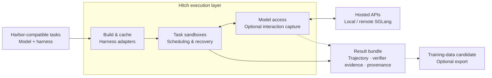

<div align="center">

# Hitch

### The execution layer for model and agent evaluation

[](https://www.npmjs.com/package/agent-hitch)
[](https://github.com/rsi-gear/agent-hitch/releases)
[](LICENSE)
[](https://discord.gg/cZ4NBbHDk)

English | [简体中文](README.zh-CN.md)

**[User Guide](https://rsigear.xyz/docs/hitch/) · [Quick Start](#quick-start) · [How It Works](#how-it-works) · [Hitch & Harbor](#hitch-and-harbor) · [Parallelism & Recovery](#parallel-execution-and-recovery)**

</div>

Evaluating models and agent harnesses means coordinating image builds,
sandboxes, harness versions, model endpoints, retries, and evidence. That work
grows as experiments run in parallel or move across machines.

**Hitch manages the path from a task definition to a verifiable result bundle.**
Submit Harbor-compatible tasks with your chosen model and harness; Hitch
prepares, schedules, executes, and collects the results. Fix the harness to
compare models, or fix the model to compare harnesses.

- [x] **Build and cache.** Pin harness versions and reuse verified artifacts and environment images.
- [x] **Adapt the harness.** Run Codex, Claude Code, and other supported harnesses through one interface.
- [x] **Connect the model.** Use hosted APIs or managed local and remote SGLang inference.
- [x] **Place the work.** Execute task sandboxes on local Docker or registered remote workers.
- [x] **Run and recover.** Share resource budgets, run trials in parallel, and preserve completed work through supported recovery paths.
- [x] **Collect the evidence.** Keep scores, trajectories, verifier evidence, and provenance in one result bundle.

> **Status:** pre-alpha. Capabilities below describe current `dev`; setup and
> support limits are covered in the [User Guide](https://rsigear.xyz/docs/hitch/).

## Quick Start

You need **Node.js 22+**, Git, and model access. Local runs do not require Docker.

**1. Install Hitch and authenticate the harness.** This example pins Codex to
an explicit version; complete its login flow before continuing.

```bash
npm install --global agent-hitch@0.2.10
npx --yes @openai/codex@0.92.0 login
```

**2. Run from a clean Git repository.** `git status --short` must show no changes
for worktree mode. To include uncommitted files, choose
[`--workspace-mode copy`](docs/guide/en/versions-and-workspaces.md).

```bash
git status --short
hitch run \
  --harness codex@version:0.92.0 \
  --workspace-mode worktree \
  --prompt "Summarize this repository and its test commands. Do not modify files." \
  --timeout 5m \
  --output json
```

**3. Inspect the result.** Replace `RUN_ID` with the returned `run_id`. Check its
status, exit code, and answer, then inspect the available trajectory.

```bash
hitch runs inspect RUN_ID --json
hitch trajectory project RUN_ID --profile analysis --json
```

Records live under `~/.hitch/runs/RUN_ID/`. Managed workspaces are retained;
Hitch does not automatically merge agent changes into your source repository.
See the [complete Quick Start](https://rsigear.xyz/docs/hitch/quickstart) for
authentication options, model selection, and parallel submission examples.

## How it works



The CLI and daemon HTTP API drive the same execution layer. Tasks define the
instructions, environment, and verifier; Hitch manages preparation, execution,
and evidence publication. Each bundle links the result to its harness revision,
model identity, environment images, and execution records.

Model interaction capture depends on the harness, endpoint, and capture policy.
Training-data candidates carry eligibility and provenance for downstream review.

[Build and cache](docs/environment-images.md) ·
[Execution and evidence contracts](docs/hitch-harbor-control-plane-implementation-status.md)

## Hitch and Harbor

Hitch adopts **Harbor's task definition format** for existing benchmarks and
custom tasks. Its [benchmark packages](docs/benchmark-packages.md) define task
inputs, tools, lifecycle hooks, and grading. Hitch manages experiment versions,
execution orchestration, recovery, and results.

| Capability | Harbor CLI | Hitch |
| --- | :---: | :---: |
| **Shared resource budget across evaluations** | — | ✅ |
| **Fair scheduling across evaluations** | — | ✅ |
| **Reattach live trials after a controller crash** | — | ✅ |
| Parallel trials, retries, and regrading | ✅ | ✅ |
| Resume interrupted evaluations | ✅ | ✅ |

Local CLI workflows. **—** = requires additional orchestration.
Fair scheduling requires known tasks; live recovery requires POSIX and retained
execution evidence. [Support details →](docs/guide/en/daemon.md)

<details>
<summary>Evidence and comparison scope</summary>

The recorded 2026-09-01 offline Harbor canary ran 20 trials with one environment
build, 19 cache hits, and zero OOMs. This validates that workload's cache reuse
and resource admission; it is not a speed or cost comparison against native Harbor.
[Validation record](docs/hitch-harbor-control-plane-implementation-status.md) ·
[Harness build reuse](docs/evals.md)

[Harbor evaluations](https://www.harborframework.com/docs/run-jobs/run-evals) ·
[Harbor retry/resume](https://github.com/harbor-framework/harbor/blob/main/src/harbor/cli/jobs.py) ·
[Harbor regrade](https://www.harborframework.com/docs/run-jobs/regrade) ·
[Hitch scheduling and recovery](docs/daemon.md)

</details>

## Local and remote model inference

Managed inference is included in current `dev`. Import a complete Hugging Face safetensors checkpoint once, then use the same
run and eval commands with a `local/<name>` model. Hitch chooses a pinned
CPU or CUDA preview runtime, starts the daemon and SGLang service when needed, and
records the immutable model/runtime/inference identities automatically.

```bash
hitch models add /models/coder-checkpoint --name coder

hitch run \
  --harness codex@version:0.145.0 \
  --model local/coder \
  --prompt "Inspect this repository"
```

The local preview targets Linux/amd64 Docker with an Intel Xeon AMX CPU or a
compatible single NVIDIA CUDA GPU. Managed Codex requires the exact version above
and a supported model tool parser. Unsupported hardware never falls back to a cloud model.

For remote inference, use your Harness’s model API configuration or register a
managed model node. Node-bound models also use `local/<name>`; the binding selects
the remote GPU host. See the [model inference guide](https://rsigear.xyz/docs/hitch/model-inference)
for setup, Docker access, parallel capacity, and service recovery.

## Parallel execution and recovery

Submit once. Follow the same Eval ID through execution and recovery.

- [x] Share CPU, memory, and GPU budgets across evaluations.
- [x] Give smaller evaluations a turn as task slots become available.
- [x] Reattach supported live trials after a daemon crash.
- [x] Collect finished results and continue unstarted tasks.
- [x] Repair selected failures while preserving valid results.

Live process recovery requires POSIX and retained execution evidence. Ordinary
Harness runs are not automatically resumed after a daemon crash.

[Setup, examples, and recovery limits →](https://rsigear.xyz/docs/hitch/daemon)

## Evaluate models and harnesses

- [x] **Compare models:** keep the harness, tasks, and evaluation settings fixed.
- [x] **Compare harnesses:** keep the model and tasks fixed; change the harness or its revision.
- [x] **Evaluate without tools:** use the trusted `model-call` driver for compatible benchmark tasks.

The current execution backend is Harbor. The Docker example below requires
Python 3.12+, a running Docker daemon, and model credentials available to the
container. See [benchmark packages](docs/benchmark-packages.md) for custom tasks
and driver requirements.

```bash
hitch eval setup harbor
hitch eval doctor
```

Start with the [one-task evaluation tutorial](https://rsigear.xyz/docs/hitch/evaluations)
and its bundled [Hello Hitch task](docs/guide/examples/hello-hitch). It covers
container authentication, execution, and result inspection before moving to a
larger benchmark. If a Hitch daemon owns your state root, use
`hitch eval run --daemon` or `hitch eval submit` as described in the guide.

Every trial publishes a Hitch run with its model identity, harness revision,
controller runtime, backend configuration, rewards, logs, and trajectory. Valid zero scores remain
distinct from invalid observations. See the [Harbor reference](docs/evals.md)
for benchmark, resource, and portability contracts.

## Supported harnesses

| Harness | Installed executable | Exact package version | Source commit |
| --- | :---: | :---: | :---: |
| Codex | ✓ | ✓ | ✓ |
| Claude Code | ✓ | ✓ | — |
| Pi | ✓ | ✓ | ✓ |
| OpenCode | ✓ | ✓ | — |
| DeepSeek Harness | ✓ | ✓ | ✓ |

Use `codex@installed` for a local executable, `codex@version:0.92.0` for an exact
package, or `codex@commit:COMMIT` with a real upstream commit. Evaluations require
a portable version or commit reference. See
[versions and workspaces](docs/guide/en/versions-and-workspaces.md) for reference
selection, artifact preparation, and workspace modes.

## User Guide

**[Read the User Guide online](https://rsigear.xyz/docs/hitch/)** or browse the
[same Markdown in this repository](docs/guide/en/index.md).

| Guide | What you will learn |
| --- | --- |
| [Quick Start](docs/guide/en/quickstart.md) | Install, authenticate, run a task, and submit parallel work |
| [Local and remote model inference](docs/guide/en/model-inference.md) | Use remote APIs, managed local SGLang, and remote model nodes |
| [Versions and workspaces](docs/guide/en/versions-and-workspaces.md) | Pin the executable and choose worktree, copy, or shared mode |
| [Runs and evidence](docs/guide/en/runs-and-evidence.md) | Query results, trajectories, verifier evidence, and feedback |
| [First evaluation](docs/guide/en/evaluations.md) | Run a small Docker task and interpret valid and invalid results |
| [Daemon: parallelism and recovery](docs/guide/en/daemon.md) | Budget resources, share capacity, and recover interrupted evaluations |
| [Operations and troubleshooting](docs/guide/en/operations.md) | Inspect queues, cancel work, select state roots, and diagnose failures |
| [CLI reference](docs/guide/en/cli-reference.md) | Look up all commands, options, filters, and integration entry points |

<details>
<summary><strong>Technical references and platform notes</strong></summary>

- [Design and architecture](docs/design.md)
- [Benchmark packages and task protocols](docs/benchmark-packages.md)
- [Harbor-backed evaluations](docs/evals.md)
- [Verifier evidence](docs/verifier-evidence.md)
- [Workspace isolation](docs/workspaces.md)
- [Daemon design](docs/daemon.md)
- [Versioned machine-interface schemas](docs/schemas)
- [Hitch 0.2 development spec](docs/hitch-0.2-development-spec.md)
- [Release process](docs/releasing.md)
- [Contributing](CONTRIBUTING.md)

Automation can use JSON/JSONL output, typed errors, bounded evidence queries,
timeouts, cancellation, and process-tree cleanup. Select a separate state root
with `--root` or `HITCH_ROOT` and use it consistently across commands.

Windows is covered on Node 22 and 24, including npm/agent `.cmd` shims and the
packaged-harness cache/integrity path. Live local Harbor process adoption after
a hard daemon crash is POSIX-only.

GPU-backed Harbor trials require a compatible Docker host and explicit
`--capacity-gpus` plus `--eval-gpus`; Hitch never guesses GPU capacity.
Maintainers can run the `NVIDIA GPU hardware canary` workflow on a compatible
self-hosted runner.

</details>

## Project status

Hitch is a pre-alpha execution layer for model and harness evaluation. Remote artifact
synchronization, named candidates, promotion records, and more harness adapters
are planned. It complements Git and currently provides no remote artifact
registry, branches, tags, candidate promotion, or rollback policy.

## Community

Join [Discord](https://discord.gg/cZ4NBbHDk) to ask questions, share feedback,
and discuss model and agent evaluation infrastructure.

Hitch draws inspiration from [Multica](https://github.com/multica-ai/multica),
adopts [Harbor](https://github.com/harbor-framework/harbor)'s task definition format,
and integrates [SGLang](https://github.com/sgl-project/sglang) for managed local
and remote model inference.

## License

[Apache License 2.0](LICENSE).
