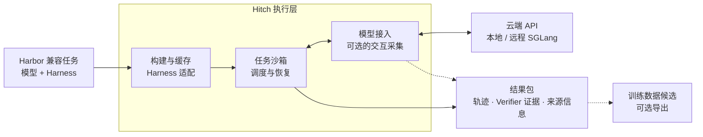

<div align="center">

# Hitch

### 模型与智能体评测的统一执行层

[](https://www.npmjs.com/package/agent-hitch)
[](https://github.com/rsi-gear/agent-hitch/releases)
[](LICENSE)
[](https://discord.gg/cZ4NBbHDk)

[English](README.md) | 简体中文

**[User Guide · 用户指南](https://rsigear.xyz/docs/hitch/zh/) · [Quick Start](#quick-start快速开始) · [工作原理](#工作原理) · [Hitch 与 Harbor](#hitch-与-harbor) · [并行与恢复](#并行执行与恢复)**

</div>

评测模型与智能体 Harness，需要协调镜像构建、沙箱、Harness 版本、模型端点、
失败重试和证据采集。实验开始并行、扩展到多台机器后，这些工作也随之增加。

**Hitch 统一管理从任务定义到可验证结果包的执行流程。** 提交 Harbor 兼容任务，
选择模型与 Harness，Hitch 负责准备、调度、执行和结果收集。固定 Harness 比较
模型，或固定模型比较 Harness。

- [x] **构建与缓存。** 固定 Harness 版本，复用已验证的制品与环境镜像。
- [x] **适配 Harness。** 通过统一接口运行 Codex、Claude Code 等受支持的 Harness。
- [x] **接入模型。** 使用云端 API，或托管的本地与远程 SGLang 推理。
- [x] **分配执行节点。** 在本机 Docker 或已注册的远程 Worker 上运行任务沙箱。
- [x] **并行与恢复。** 共享资源预算、并行执行 Trial，在支持的恢复路径中保留已完成工作。
- [x] **收齐结果证据。** 分数、轨迹、Verifier 证据与来源信息归入同一份结果包。

> **状态：** pre-alpha。以下能力对应当前 `dev`；配置与支持范围见
> [User Guide](https://rsigear.xyz/docs/hitch/zh/)。

## Quick Start：快速开始

需要 **Node.js 22+**、Git 和模型访问权限。本地运行不需要 Docker。

**1. 安装 Hitch，并完成 Harness 认证。** 示例固定了一个 Codex 版本，
继续前先完成登录流程。

在 0.2.10 发布到 npm 前，请按[源码安装说明](docs/guide/zh-CN/model-inference.md#使用当前-dev-构建)使用当前 dev。

```bash
npm install --global agent-hitch@0.2.10
npx --yes @openai/codex@0.92.0 login
```

**2. 从干净的 Git 仓库运行。** Worktree 模式要求 `git status --short` 没有
输出。要包含当前未提交的文件，可以选择
[`--workspace-mode copy`](docs/guide/zh-CN/versions-and-workspaces.md)。

```bash
git status --short
hitch run \
  --harness codex@version:0.92.0 \
  --workspace-mode worktree \
  --prompt "总结这个仓库及其测试命令，不修改文件。" \
  --timeout 5m \
  --output json
```

**3. 检查运行结果。** 用返回的 `run_id` 替换 `RUN_ID`。确认状态、退出码和
回答，再查看已捕获的轨迹。

```bash
hitch runs inspect RUN_ID --json
hitch trajectory project RUN_ID --profile analysis --json
```

记录保存在 `~/.hitch/runs/RUN_ID/`。托管工作区会被保留，Hitch 不会自动把
智能体修改合并回源码仓库。认证方式、模型选择和并行提交示例见
[完整 Quick Start](https://rsigear.xyz/docs/hitch/zh/quickstart)。

## 工作原理



CLI 与 daemon HTTP API 使用同一执行层。任务定义指令、环境和 Verifier；
Hitch 管理准备、执行与证据发布。每份结果包关联实际使用的 Harness 版本、
模型身份、环境镜像和执行记录。

模型交互采集取决于 Harness、端点和采集策略。训练数据候选保留可用性判定
和来源信息，供下游审核。

[构建与缓存](docs/environment-images.md) ·
[执行与证据契约](docs/hitch-harbor-control-plane-implementation-status.md)

## Hitch 与 Harbor

Hitch 采用 **Harbor 的任务定义格式**，接入已有 Benchmark 和自定义任务。
[Benchmark Package](docs/benchmark-packages.md) 定义任务输入、工具、生命周期
与评分规则；Hitch 管理实验版本、执行编排、故障恢复和结果。

| 能力 | Harbor CLI | Hitch |
| --- | :---: | :---: |
| **跨评测共享资源预算** | — | ✅ |
| **跨评测公平调度** | — | ✅ |
| **控制进程崩溃后接管存活 Trial** | — | ✅ |
| 并行 Trial、失败重试与重新评分 | ✅ | ✅ |
| 中断评测续跑 | ✅ | ✅ |

对比本机 CLI 工作流。**—** 表示需要额外的协调层。
公平调度要求任务成员已知；存活执行接管要求 POSIX 和完整执行证据。
[支持范围 →](docs/guide/zh-CN/daemon.md)

<details>
<summary>验证记录与对比范围</summary>

2026-09-01 的离线 Harbor 验收记录包含 20 个 Trial、1 次环境构建、19 次缓存
命中和 0 次 OOM。这验证了该负载下的缓存复用与资源准入，不是与原生 Harbor
的速度或成本对照实验。
[验收记录](docs/hitch-harbor-control-plane-implementation-status.md) ·
[Harness 构建复用](docs/evals.md)

[Harbor 评测](https://www.harborframework.com/docs/run-jobs/run-evals) ·
[Harbor 重试与恢复](https://github.com/harbor-framework/harbor/blob/main/src/harbor/cli/jobs.py) ·
[Harbor 重新评分](https://www.harborframework.com/docs/run-jobs/regrade) ·
[Hitch 调度与恢复](docs/daemon.md)

</details>

## 本地与远程模型推理

当前 `dev` 已包含托管推理。完整的 Hugging Face safetensors checkpoint 只需导入一次，此后继续使用原有
run/eval 命令，并把模型写成 `local/<name>`。Hitch 会自动选择固定摘要的 CPU 或
CUDA preview runtime、按需启动 daemon 和 SGLang 服务，并记录不可变的模型、runtime
和 inference 身份。

```bash
hitch models add /models/coder-checkpoint --name coder

hitch run \
  --harness codex@version:0.145.0 \
  --model local/coder \
  --prompt "Inspect this repository"
```

本机预览面向 Linux/amd64 Docker，以及 Intel Xeon AMX CPU 或兼容的单张
NVIDIA CUDA GPU。托管 Codex 要求上述确定版本及受支持的模型工具解析器；
不支持的硬件不会回退到云模型。

远程推理可以通过 Harness 的模型 API 配置接入，也可以注册托管模型节点。
节点模型仍使用 `local/<name>`，由绑定选择远程 GPU 主机。配置、Docker 访问、
并行容量与服务恢复见[模型推理指南](https://rsigear.xyz/docs/hitch/zh/model-inference)。

## 并行执行与恢复

提交一次，用同一个 Eval ID 跟踪执行与恢复。

- [x] 多个评测共享 CPU、内存和 GPU 预算。
- [x] 任务槽位释放后，小评测也能获得调度机会。
- [x] Daemon 崩溃后接管受支持的存活 Trial。
- [x] 补收已完成结果，继续未启动任务。
- [x] 只修复选中的失败，保留有效结果。

存活进程接管要求 POSIX 和完整的执行证据；普通 Harness Run 不会在 daemon
崩溃后自动续跑。

[配置、示例与恢复边界 →](https://rsigear.xyz/docs/hitch/zh/daemon)

## 评测模型与 Harness

- [x] **比较模型：** 固定 Harness、任务和评测配置，更换模型。
- [x] **比较 Harness：** 固定模型和任务，更换 Harness 或其版本。
- [x] **无工具模型评测：** 对兼容的 Benchmark 任务使用可信的 `model-call` 驱动。

当前执行后端为 Harbor。下面的 Docker 示例需要 Python 3.12+、运行中的
Docker daemon，以及容器能够使用的模型认证。自定义任务和驱动要求见
[Benchmark Package](docs/benchmark-packages.md)。

```bash
hitch eval setup harbor
hitch eval doctor
```

先按[单任务评测教程](https://rsigear.xyz/docs/hitch/zh/evaluations)运行附带的
[Hello Hitch 任务](docs/guide/examples/hello-hitch)，完成容器认证、执行和结果
检查，再扩展到大型 Benchmark。若 Hitch daemon 已占用状态目录，按指南使用
`hitch eval run --daemon` 或 `hitch eval submit`。

每个 Trial 发布一个 Hitch Run，关联模型身份、Harness 版本、控制器运行时、后端配置、
奖励、日志和轨迹。有效零分与无效 observation 会分别处理。Benchmark、资源和
可移植性契约见 [Harbor 参考](docs/evals.md)。

## 支持的 Harness

| Harness | 已安装的可执行文件 | 确定的软件包版本 | 源码提交 |
| --- | :---: | :---: | :---: |
| Codex | ✓ | ✓ | ✓ |
| Claude Code | ✓ | ✓ | — |
| Pi | ✓ | ✓ | ✓ |
| OpenCode | ✓ | ✓ | — |
| DeepSeek Harness | ✓ | ✓ | ✓ |

使用 `codex@installed` 运行本机程序，使用 `codex@version:0.92.0` 选择确定的
软件包版本，或把真实上游提交填入 `codex@commit:COMMIT`。评测要求可移植的
版本或提交引用。引用选择、制品准备和工作区模式见
[固定版本与隔离工作区](docs/guide/zh-CN/versions-and-workspaces.md)。

## User Guide · 用户指南

**[在线阅读用户指南](https://rsigear.xyz/docs/hitch/zh/)**，也可以查看
[仓库中的同一份 Markdown](docs/guide/zh-CN/index.md)。

| 指南 | 你会学到什么 |
| --- | --- |
| [Quick Start](docs/guide/zh-CN/quickstart.md) | 安装、认证、运行任务并提交并行工作 |
| [本地与远程模型推理](docs/guide/zh-CN/model-inference.md) | 接入远程 API、托管本机 SGLang 和远程模型节点 |
| [固定版本与隔离工作区](docs/guide/zh-CN/versions-and-workspaces.md) | 固定可执行版本，选择 worktree、copy 或 shared 模式 |
| [查看运行与证据](docs/guide/zh-CN/runs-and-evidence.md) | 查询结果、轨迹、Verifier 证据和消息反馈 |
| [第一次评测](docs/guide/zh-CN/evaluations.md) | 运行小型 Docker 任务，理解有效与无效结果 |
| [Daemon：并行与恢复](docs/guide/zh-CN/daemon.md) | 配置资源预算、共享容量并恢复中断的评测 |
| [日常运行与排错](docs/guide/zh-CN/operations.md) | 查看队列、取消任务、选择状态目录并诊断失败 |
| [CLI 命令参考](docs/guide/zh-CN/cli-reference.md) | 查询全部命令、参数、筛选条件和集成入口 |

<details>
<summary><strong>技术参考与平台说明</strong></summary>

- [设计与架构](docs/design.md)
- [Benchmark Package 与任务协议](docs/benchmark-packages.md)
- [Harbor 评测](docs/evals.md)
- [Verifier evidence](docs/verifier-evidence.md)
- [工作区隔离](docs/workspaces.md)
- [Daemon 设计](docs/daemon.md)
- [带版本的机器接口 Schema](docs/schemas)
- [Hitch 0.2 开发规范](docs/hitch-0.2-development-spec.md)
- [发布流程](docs/releasing.md)
- [贡献指南](CONTRIBUTING.md)

自动化流程可以使用 JSON/JSONL 输出、类型化错误、有界证据查询、超时、取消和
进程树清理。通过 `--root` 或 `HITCH_ROOT` 选择独立状态目录，并在所有命令中
保持一致。

Windows 已覆盖 Node 22 和 24，包括 npm/Agent 的 `.cmd` 包装程序以及软件包
Harness 缓存和完整性校验。Daemon 硬崩溃后的本地存活 Harbor 进程接管仅支持 POSIX。

GPU Harbor Trial 需要兼容的 Docker 主机，以及显式的 `--capacity-gpus` 和
`--eval-gpus` 参数；Hitch 不会猜测 GPU 容量。维护者可以在兼容的自托管 Runner
上运行 `NVIDIA GPU hardware canary` 工作流。

</details>

## 项目状态

Hitch 是 pre-alpha 阶段的模型与 Harness 评测执行层。远端制品同步、命名候选、晋级记录
和更多 Harness 适配器已列入计划。它是 Git 的补充，目前不提供远端制品注册表、
分支、标签、候选晋级或回滚策略。

## 社区

加入 [Discord](https://discord.gg/cZ4NBbHDk)，提问、分享反馈，并讨论模型与
智能体评测基础设施。

Hitch 的设计受到 [Multica](https://github.com/multica-ai/multica) 启发，采用
[Harbor](https://github.com/harbor-framework/harbor) 的任务定义格式，并集成
[SGLang](https://github.com/sgl-project/sglang)，提供托管的本地与远程模型推理支持。

## 许可证

[Apache License 2.0](LICENSE)。
