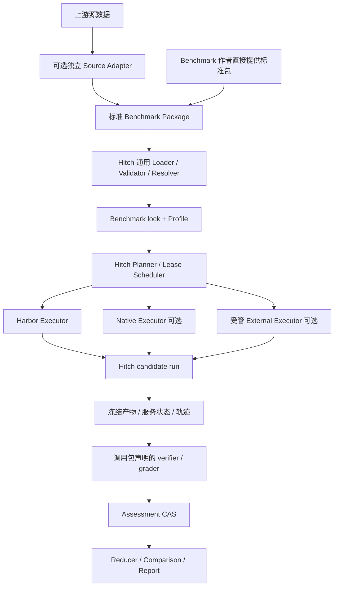

# Hitch Benchmark 接入协议与 Eval 实现 Spec

状态：Proposed；调研日期：2026-09-02。代码基线：`65982cb059ae21d84dc0bc1916eb4fff60809e4b`，Hitch 0.2.7，仓库默认 Harbor 0.21.0。

本文保留最初的实现设计，并在第 9 节补充接入进度。设计阶段核对了发布页、benchmark 官方资料、Hitch 源码和本机 Harbor 的配置模型；后续实现、真实运行结果与剩余阻塞以 `docs/benchmark-expansion-status.json` 为准，不能将设计条目视为全部已完成。上游 `main` 页面只用于调研，运行时另行锁定提交和数据文件。

当前扩展目标是其余六项 benchmark 各预选随机两题，完成 Hitch 执行和有效评分。截至 2026-09-03，GDPval-public-rubric 为 2/2、Science 为 2/2、Terminal-Bench 为 1/2，其余三项为 0/2；有效评分允许任务得分为零。用户已完成 Hugging Face 授权，本机 OAuth 登录和 HLE/OSWorld 三个 gated 仓库的实际文件读取均已验证；HLE 两种 profile 的真实两题包已锁定，OSWorld 两题源码已通过官方哈希校验。整体目标仍缺 CursorBench 授权包、HLE API 凭据及 16 CPU worker，OSWorld 完整运行环境也尚未验收。状态文件列出了逐项恢复条件；原始两题选择、任务资源和完整验收范围保持不变。下面的 MVP 描述保留最初阶段的设计范围。

## 1. 设计决定

**由 Hitch 定义稳定的 Benchmark Package v1 与执行协议。新 benchmark 提供符合协议的评测包，即可通过统一入口运行；在已有能力范围内，新增 benchmark 不修改 Hitch 核心。** Benchmark 包负责题目、环境、工具、初始化/状态导出与评分规则；Hitch 负责校验、能力匹配、候选执行、资源调度、证据和结果管理。

协议由声明式配置和可执行组件组成：简单任务提供文件与评分脚本；复杂任务可附带 simulator、工具服务和 grader，但都通过固定接口调用。Hitch 核心不得按 benchmark 名称选择业务逻辑，不维护 `automationbench / hle / osworld` 的必选枚举。新交互能力（如桌面控制）需要新增通用 driver/provider；仅增加使用已有能力的 benchmark 时，只增加包或独立源数据适配器。

Harbor 是第一种兼容任务格式和默认执行后端。Package v1 复用 Harbor task 配置，Hitch 扩展放在独立文件；包的语义与入口由 Hitch 协议定义，不依赖必须调用 Harbor CLI。未来 backend 只有通过能力校验与一致性验证，才能执行同一个包。

**本次 MVP 先实现最小通用协议，再用 AutomationBench-public 的两个真实 task 验证。** 功能验收仍为“接入并识别任务、完成两题真实执行与官方评分”；接入项同时要求用另一个本地 synthetic 包验证换包无需修改 Hitch 核心。该 fixture 不增加真实 benchmark 或付费模型运行范围。任务得分可以为 0，执行或评分报错不算跑通。完整 Eval V2、全量评测、其他真实 benchmark 和多后端能力均不作为前置条件；最小标准包、锁定、生命周期、工具与指标映射不能留到后续再做。

四个对象分别版本化：

| 对象 | 回答的问题 | 不可变身份 |
| --- | --- | --- |
| Benchmark package | 哪些题、哪些附件、什么初始环境？ | dataset lock + 每题内容摘要 |
| Evaluation profile | 允许什么工具、运行多久、如何结束？ | profile digest |
| Candidate | 哪个 harness、模型、参数和工具配置？ | revision/artifact/runtime/model identities |
| Assessment | 根据哪些证据、用哪个 verifier、得到什么分？ | input snapshot + grader + metric spec digests |

默认评测对象是 **Hitch 管理的 harness + model + profile**。更换 harness 后的结果可以用于比较 Hitch candidates，但不能自动当作发布页中同一模型分数的复现。

实施顺序：最小协议与通用 package loader/runner → AutomationBench 标准包与两题运行、换包验证 → 完整计分/报告与公共 terminal 包、HLE、AutomationBench 扩展验证 → 产物评审/GDPval → OSWorld；`native` backend 是可选的后续实现。CursorBench 原始数据不可得时只保留标准包接入边界。

## 2. 发布页中的 benchmark 与复现边界

主结果表包含以下七项。分数只用于标识页面口径，不是本次测量值。发布页还给出了成本—准确率曲线，因此评测必须保存 effort、token 和价格版本。[Anthropic 发布页](https://www.anthropic.com/claude-fable-and-mythos-5-1)

| Benchmark / 页面 Fable 5.1 分数 | 官方数据与计分事实 | Hitch 接入与限制 |
| --- | --- | --- |
| Terminal-Bench-Science 0.1 / 52.6% | 70 个科学工作流任务，Harbor 原生；官方说明该版不需要 GPU。 | 直接导入，保留每题环境、超时与 verifier。先适配本地/远端 Docker；原作者使用 Modal，不等于 Docker 已通过验证。[运行说明](https://www.terminal-bench-science.ai/run)、[源码](https://github.com/harbor-framework/terminal-bench-science) |
| Terminal-Bench 4.0 / 55.8%；Mythos 60.9% | 当前官网明确标为 4.0，报告 resolution rate 与成本。 | Harbor 原生导入。必须锁 4.0 的 membership，不能用 Hitch 文档里的 2.0 代替，也不能从版本名猜题数。[官网](https://www.tbench.ai/)、[运行入口](https://www.tbench.ai/run) |
| Humanity’s Last Exam / 60.9% 无工具、65.0% 有工具 | 官方发布多模态选择/短答题及预测、judge 脚本；数据会修订，README 的规模说明不是 immutable manifest。 | 一题一任务，答案对 agent 隐藏。`no-tools` 与 `with-tools` 是不同 profile；只跑文本题必须另命名。[官方仓库](https://github.com/centerforaisafety/hle) |
| AutomationBench / 31.4% | 公开集含六领域各 100 题；simple 的 200 题不进入主分。输出 `partial_credit` 和全断言通过的 `task_completed_correctly`。榜单使用另一套私有任务。 | 模拟 SaaS 环境 + 工具桥 + 官方状态断言；公共集标记 `public`，不能称作页面私有榜单复现。[官方 README](https://github.com/zapier/AutomationBench/blob/main/README.md) |
| GDPval-AA v2 / 1853 | 使用 GDPval 220 题，产物盲评后拟合 Bradley–Terry 得到 Elo；v2 使用三个 frontier judge 组成的 panel，人类锚点为 1000。 | 先实现 GDPval-public 的文件产物与本地评审；得到同一 AA grading pool、修复后的输入和评分协议之前，不能把本地 Elo 标作 GDPval-AA。[AA 方法](https://artificialanalysis.ai/methodology/intelligence-benchmarking)、[AA 页面](https://artificialanalysis.ai/evaluations/gdpval-aa) |
| OSWorld 2.0 / partial 77.9%、strict 41.7% | 已确认官方发布 `osworld-v2-2026.08.08`；代码、Python task、完整 assets 与网站必须配套，task/assets 仍需 gated dataset。 | VM/桌面环境 + computer-use bridge + 官方 evaluator。**发布页脚注明确使用 2026 年 8 月任务**；实施选用匹配的 8 月 release，并将各组件 tag 解析到 commit/hash。[官方仓库](https://github.com/xlang-ai/OSWorld-V2)、[发布记录](https://github.com/xlang-ai/OSWorld-V2/releases)、[发布页脚注](https://www.anthropic.com/claude-fable-and-mythos-5-1) |
| CursorBench 3.2.0 / 73.4% | Cursor 描述它为基于真实内部会话的内部 eval，公开分数和方法；本次未找到完整公开任务和 grader。 | 取得授权包后导入 repo snapshot + query + grader；自建任务使用 `hitch-coding-workflows` 等独立名称。[榜单](https://cursor.com/cursorbench)、[方法](https://cursor.com/blog/cursorbench) |

额外的口径要求：

- 发布页包含 safeguards 介入、某些场景记零及某些场景模型 fallback 的说明。记录 requested model、可观察到的 effective model、fallback policy 与干预事件；无法观测就填 `unknown`，不能伪造“纯模型”身份。
- Science 的公开榜单使用每题三次运行；这不等于 best-of-3。本文默认采用任务等权的重复试验均值，见第 8 节。
- 页面引述的 RedlineBench、FrontierFinance，以及合作方自有 finance、slide、incident、browser eval，属于附加/内部评测，缺少完整任务与评分协议。取得数据后通过相同 package 协议接入，不承诺复现。科研展示与安全测试也不是可直接下载的一套 terminal tasks。[发布页](https://www.anthropic.com/claude-fable-and-mythos-5-1)
- 页面指向的 system card 在本次抓取中返回错误；本文不假定已经拿到未公开的 prompt、工具列表、精确预算或完整安全评测定义。

## 3. Hitch 现有能力与实际缺口

下表中的路径均相对于本仓库；实现者应在对应模块扩展。

| 现有位置 | 已有行为 | 本 spec 的改动 |
| --- | --- | --- |
| `src/domain/evals.ts`、`src/evals/request.ts` | request 的 backend 只接受 `harbor`；本地目录有 workspace digest，远端 selector 拒绝 `latest`。 | 增加 V2 request 与锁定包；远端 tag 必须解析到实际文件/提交，不能仅存版本字符串。 |
| `src/evals/local-eval-planning.ts`、`execution-plan.ts` | 本地可枚举 task/attempt，已有资源预留和 immutable execution plan。 | 从 lock 的显式任务清单规划，支持 package 下的 `tasks/`；禁止远端 benchmark 在正式评测中走 opaque membership。 |
| `src/backends/harbor/backend.ts` | `HitchHarborAgent` 调用真正的 Hitch harness，保留 revision 与 run bundle。 | 保留路径；增加 profile 编译和 normalized backend evidence，禁止用 Harbor 内置 agent 偷换 candidate。 |
| `src/backends/harbor/backend.ts: buildHarborJobConfig` | 总超时默认 15 分钟，传给每个 Hitch run，并设置 Harbor agent override +30 秒。 | V2 默认继承每题预算，清理宽限不计入 agent 解题时间，不能把所有科学/GUI任务强制缩成 15 分钟。 |
| `src/evals/verifier-diagnostics.ts` | 原始 rewards 保留，但 primary 取 `reward` 或第一个数值；非 succeeded run 视为 infrastructure invalid。 | 按 metric spec 显式选择；区分预算耗尽、拒答、模型错误和 infra；不能因超时从计分分母删除难题。 |
| `src/evals/result-helpers.ts` | 汇总已发布 trial 的单个 reward；raw Harbor normalization 则有多维统计。 | canonical assessment 才是报告来源，统一两条统计路径，避免多指标丢失或顺序决定主分。 |
| `src/runs/identity.ts` | task/verifier identity 由 benchmark 字符串生成。 | 新身份来自实际 task tree、grader、依赖、协议；既有 identity 保留 legacy 语义。 |
| `src/evals/rerun*.ts`、`integrations/harbor/hitch_harbor_verifier.py` | 已有 candidate restart/resume/replay、verifier-only、collect-only；verifier 可在 live env 重试。 | 增加对冻结 snapshot 的离线 regrade；现有 retained-env 重试不能自动等同为可永久重评。 |
| `src/adapters/contract.ts`、`src/domain/runs.ts` | prompt 为字符串，capabilities 没有标准化 image input、强制工具限制、CUA action 接口。 | 增加经过验证的 protocol capabilities；不从“structured_tool_events=true”推断可安全执行 no-tools/GUI。 |
| `src/domain/providers.ts`、control-plane、workers | 已有 provider/lease/recovery、Docker、GPU 计数、远端 worker、capture、bundle。 | 复用这些机制；OSWorld 增加 VM/namespace 能力与容量，不能另起不受配额控制的进程。 |

本机安装的 Harbor 0.21.0 `TaskConfig` 默认 `schema_version="1.4"`，接受旧 `version` 字段迁移；支持独立 verifier、artifacts 和 collect。实际 `Verifier` 先读 `reward.json`，再读 `reward.txt`。在线不同页面对此有不一致说明，因此实现以**锁定版本的行为测试**为准；新任务只写一种 reward 文件。[任务格式](https://www.harborframework.com/docs/tasks)

## 4. Benchmark Package v1：Hitch 标准与 Harbor 兼容格式

### 4.1 目录

```text
benchmark-package/
  benchmark.toml                # Hitch 协议版本、任务清单、profile、指标定义
  benchmark.lock.json           # 通用 resolver 生成/校验，正式执行的唯一输入
  profiles/
    default.json                # 工具、预算、计分与采样协议
  tasks/
    workflow-001/
      instruction.md            # 原始任务说明
      task.toml                 # 合法 Harbor 配置，原样保留
      task.hitch.json           # driver、生命周期、工具、证据与评分入口
      environment/
        Dockerfile
      solution/solve.sh         # 可选，只给 oracle
      tests/
        Dockerfile              # separate verifier 时使用
        test.sh
        grader.py
  runtime/                      # 可选：包自带的服务、hooks、工具桥、依赖锁
  source-manifest.json          # 上游 task id → 本地 id，许可证、canary、来源
```

`benchmark.toml` 是统一发现入口；已符合标准的包无需 benchmark 专用 importer。源数据适配器是可选的独立工具，只负责把上游数据转换成这个目录；它不参与正式 trial 调度，也不直接生成可被绕过校验的运行计划。适配器可以与包一同维护，但所有产物仍经过 Hitch 通用 resolver/validator。

Package v1 的 `task_format` 固定为 Harbor 兼容格式，优先复用其环境、资源和 verifier 字段；这不意味着 Hitch 协议等同于 Harbor runtime API。`tasks/<id>/` 可在满足能力约束时交给 Harbor。普通 `harbor run` 不会自动支持 Hitch 特有的生命周期、工具桥或 VM；export 时必须报告所需能力。导入现有 Harbor 数据集时不改写 instruction、测试或难度参数；转换字段记录 transformation 与前后 digest。未来增加其他任务格式需注册通用格式解析器，不能注册 benchmark 名称分支。

公共素材、oracle、答案、grader 的访问边界不能依赖目录命名：controller 持有完整 package，Candidate 只接收 instruction 与允许的 environment/input files，不能挂载 package 根目录。大文件进独立 CAS，task 文件只引用 hash；不要为每道 HLE 题复制完整数据集。

### 4.2 可校验的示例

下列是 **synthetic fixture**，用于定义格式，不是某个上游任务，也不代表其资源设置。

`benchmark.toml`：

```toml
schema_version = "1"
protocol = "hitch-benchmark@1"
id = "hitch-fixture/workflows"
release = "0.1.0"
task_root = "tasks"
task_ids = ["workflow-001"]
default_profile = "profiles/default.json"
primary_metric = "strict_success"

[task_format]
name = "harbor"
schema_version = "1.4"

[source]
kind = "local"
path = "."
license = "Apache-2.0"

[metrics.strict_success]
type = "binary"
direction = "maximize"
range = [0, 1]
reducer = "task_macro_mean"

[metrics.partial_credit]
type = "scalar"
direction = "maximize"
range = [0, 1]
reducer = "task_macro_mean"

[publication]
track = "custom"
```

`tasks/workflow-001/task.toml`：

```toml
schema_version = "1.4"
artifacts = ["/app/output"]

[task]
name = "hitch-fixture/workflow-001"
version = "0.1.0"

[metadata]
category = "workflow"
tags = ["synthetic", "smoke"]

[agent]
timeout_sec = 1800.0

[environment]
cpus = 2
memory_mb = 4096
storage_mb = 10240

[verifier]
timeout_sec = 300.0
environment_mode = "separate"

[verifier.environment]
cpus = 1
memory_mb = 1024
```

`task.hitch.json`：

```json
{
  "schema_version": "1",
  "source_task_id": "workflow-001",
  "driver": {"kind": "terminal", "protocol_version": "1", "config": {}},
  "requirements": ["shell", "artifact-export", "separate-verifier"],
  "submission": {
    "kind": "artifacts",
    "paths": ["/app/output"],
    "max_bytes": 104857600
  },
  "grading": {
    "kind": "command",
    "entrypoint": ["bash", "/tests/test.sh"],
    "metric_map": {
      "strict_success": "strict_success",
      "partial_credit": "partial_credit"
    }
  }
}
```

此例的 `tests/Dockerfile` 必须安装固定版本 grader、将 `tests/test.sh` 放入镜像；grader 检查 `/app/output`。上游 separate-verifier 模式不会自动把共享模式的所有工作目录复制过去；所需输入必须列为 artifact。对业务状态应收集可信 sidecar snapshot，不能接受 agent 自己写的“最终状态”。[Harbor artifact / verifier 约定](https://www.harborframework.com/docs/tasks)

### 4.3 Lock 的规范

`BenchmarkLockV1` 至少包含：

```ts
interface BenchmarkLockV1 {
  schema_version: "1";
  benchmark_id: string;
  release: string;                         // 展示名，不作为内容证据
  package_digest: Sha256;
  source: {
    kind: "local" | "git" | "registry" | "dataset";
    uri: string;
    requested_ref?: string;
    resolved_revision: string;             // Git/HF commit、registry ID 或本地内容摘要
    access: "public" | "gated" | "private";
    manifest_digest: Sha256;
  };
  components: Array<{                     // OSWorld等组合发布的每个组件
    role: string; uri: string; resolved_revision: string; digest: Sha256;
  }>;
  protocol: "hitch-benchmark@1";
  resolver: { id: string; version: string; code_digest: Sha256 };
  source_adapter?: { id: string; version: string; code_digest: Sha256 };
  task_dialect: { name: "harbor"; schema_version: string };
  runtime_components: Array<{             // 包内 hooks/服务/工具 schema 与依赖
    id: string; protocol: string; content_digest: Sha256;
  }>;
  tasks: Array<{
    task_id: string; source_task_id: string; path: string;
    task_digest: Sha256; input_digest: Sha256; grader_digest: Sha256;
    environment_refs: Array<
      { role: string; kind: "image"; digest: Sha256; platform: string } |
      { role: string; kind: "build"; context_digest: Sha256;
        base_image_digests: Sha256[]; platform: string }
    >;
  }>;
  profile_digest: Sha256;
  required_capabilities: string[];
  metric_spec_digest: Sha256;
  transformations: Array<{ kind: string; before: Sha256; after: Sha256 }>;
}
```

规范要求：

1. 按 task_id 排序后 canonical JSON/hash；不把 host path、下载时间和 secret 值放进内容身份。manifest 时间存 provenance sidecar，`package_digest` 排除 lock 自身，避免循环。
2. hash 覆盖 instruction、配置、文件内容/权限/合法 symlink、依赖锁、grader prompt、参考答案和 rubric；每题身份也覆盖该题引用的共享 hooks、工具 schema 与 runtime 组件摘要。image identity 包含 platform 与实际 digest。多架构 tag 不能只记一个显示名。
3. tag 可以作为 import 参数，但 eval 只接受已经 materialize 的 lock。拒绝 unresolved/`latest` 运行；Science 官网的 `@latest` 示例应先解析成指定 release 的固定内容，不臆造 `@0.1` 可用。
4. task list、split、过滤规则和排除原因都冻结；task id 唯一，禁止路径越界、跨 package symlink、同名覆盖。每个 scheduled slot 都能追到清单中的一题。
5. 不支持的 Harbor schema/字段必须失败，不可静默丢弃 `steps`、network、verifier collect、MCP 或 VM 需求。保留原文，并输出 `unsupported_feature`。
6. License、canary 与上游使用条件随包保存；公开 eval 包默认不进入 Hitch 的 training-candidate export，需显式 eligibility policy。这里是数据集自己的边界，不改动用户原始任务数据。

手工编写的本地标准包不要求上游仓库或 adapter。`source.kind="local"` 时 `resolved_revision` 使用封存的源内容摘要，`uri` 使用对应 CAS URI，`requested_ref` 可省略；原始宿主路径只存 provenance sidecar。`source_adapter` 仅在实际执行过源数据转换时填写，不能为直接加载的包伪造转换器。

导入 Dockerfile 时先锁构建上下文和 base image，不要求 import 立即执行构建。preparation 阶段把构建结果的实际 image digest 补入冻结的 execution plan，Candidate 启动前必须完成；同一 eval 重试复用该镜像。依赖安装不能完全复现时保留构建产物用于后续运行，并标明复现依赖；跨 eval 的 cohort 校验实际 image identity，不能只比较 Dockerfile 文本。

### 4.4 标准包的责任与扩展边界

| 合同 | 包提供的定义 | Hitch 的通用职责 |
| --- | --- | --- |
| Tasks | 显式 task IDs、instruction、输入、来源映射 | 枚举、过滤后锁定、规划每次运行 |
| Environment | Harbor 环境/服务声明、资源与镜像/依赖 | 构建、能力检查、分配与回收资源 |
| Interaction | `driver.kind/protocol_version/config`、工具 schema 与可见范围 | 用通用 driver 将允许的交互能力交给 Hitch harness |
| Lifecycle | `task.hitch.json.lifecycle` 中的 prepare/quiesce/snapshot/cleanup hooks | 按统一顺序调用、超时、幂等与 lease fencing |
| Submission / evidence | 需收集的文件、最终回答、权威服务状态 | 截止后收集并封存，区分 candidate 与 controller 来源 |
| Grading | `grading.kind/entrypoint/metric_map`、官方 grader 与私有参考数据 | 独立调用或接收 backend 已执行的 grader，校验并归一化结果 |
| Metrics / profile | 主指标、范围、聚合、预算、采样和工具政策 | 按声明执行，完整记录参数，产出可比较结果 |

路径引用必须声明基准：manifest 中的相对文件路径以 package 根为基准；Harbor task 内的原有路径保留 Harbor 语义；hook 的 `argv` 是目标运行环境内的命令和路径，不是 controller 的宿主路径。包内共享脚本进入对应环境的固定构建上下文或只读挂载，并参与摘要。

最小运行接口不允许 `driver.kind="automationbench"` 或 `grading.kind="hle"` 这样的业务枚举。内置能力按 `terminal`、`tool-server`、`desktop` 等交互类型组织，评分按 `command` 等调用协议组织；具体业务逻辑来自包内组件。driver 的 `config` 按已注册的版本化 schema 校验，包不能自行发明未实现的能力。独立 driver/provider 扩展需注册接口与能力并通过验证；MVP 不建设插件市场或自动安装机制。

支持矩阵的键为 `(package protocol, task format, driver protocol, backend, provider/harness capabilities)`，不使用 benchmark 名称。未知必需字段、协议版本、工具传输、grader 类型或 capability 在 Candidate 启动前返回 `unsupported_feature`，不自动忽略或降级。

协议 schema 与语义一起版本化；改变必需字段、生命周期或评分含义必须提升协议版本。包 release 只表示数据/组件发布，不能改变同版本协议的含义。向后兼容的元数据放显式 `extensions` namespace，任何影响执行或计分的扩展同时声明 required capability；旧 runtime 不认识该能力时拒绝执行。

### 4.5 MVP 必须实现的通用子集

MVP 实现 Package v1 的本地加载、显式任务枚举、内容锁、Harbor 编译/执行、一个真实 Hitch harness、通用 `tool-server@1` driver、command grader 与声明式多指标映射。工具传输只实现该 harness 已能支持的一种，并在 driver 的能力声明与包配置中锁定；不同工具名称及 JSON Schema 由包提供，不在 Hitch 内硬编码官方函数。

Lifecycle hooks 采用第 5.4 节的版本化命令协议，由受管 worker 执行。常规资源启动/回收使用已有 provider，hook 只补充环境特有的初始化与状态处理。包声明使用的 hook 均须实现，不能因为 MVP 而忽略。完整 report/comparison/regrade、所有 driver 与 Eval V2 API 可以后续交付。

MVP 可以沿用 V1 eval/run/bundle 存储，但必须封存标准 manifest/lock/effective profile，并保存 source task id、Hitch run id、原始 rewards 与显式 primary 的关联。包协议的 v1 和 Eval request/result 的 V1/V2 是不同版本轴，不互相绑定。

## 5. 执行协议与接口

### 5.1 Profile 必须声明的语义

`profiles/default.json` 的 fixture 示例：

```json
{
  "schema_version": "1",
  "id": "hitch-fixture/workflow-default",
  "track": "custom",
  "input_mode": "instruction",
  "tool_policy": {
    "id": "terminal-v1",
    "allowed": ["shell", "filesystem"],
    "network": "model-endpoint-only",
    "enforcement": "required"
  },
  "budget": {
    "agent_timeout": {"source": "task"},
    "setup_timeout_ms": 1800000,
    "collection_timeout_ms": 60000,
    "cleanup_grace_ms": 30000
  },
  "sampling": {"attempts_per_task": 3, "seed": 42},
  "grading": {
    "on_agent_budget_exhausted": "grade_final_state",
    "on_missing_submission": "zero",
    "infrastructure_retries": 1
  },
  "reporting": {
    "official_score_requires_complete_coverage": true,
    "confidence_interval": "task_cluster_bootstrap"
  }
}
```

`network="model-endpoint-only"` 是 Hitch 的逻辑策略，不是 Harbor 原生枚举：compiler 必须生成实际 endpoint allowlist/隔离网络并验证。若当前 provider、harness 或代理不能强制执行，就在 preflight 拒绝此 profile。已有 capture proxy 只负责观测，不应被误当作已实现的访问控制。

生产 profile 另保存：输入 modality、system prompt、工具 JSON Schema、工具描述、观察方式、action space、turn/step/token 上限、temperature/effort 请求及实际支持状态、模型路由策略、初始时间/时区、服务 seed、可见资源、grader 配置。没有公开值的参数写明由 Hitch 自定；不能把 `high` 跨供应商当成等价计算量。

预算优先级为 `显式 override > profile > task > 有记录的 fallback`。正式上游协议默认 `source=task`；任何改变语义的 override 改为 adapted/custom track。host 排队、镜像构建、agent setup、Candidate 执行、collection、grading、cleanup 分别计时。`cleanup_grace_ms` 期间必须已停止模型请求和工具动作，只导出证据。

随机种子用于题目顺序、采样和模拟环境；模型服务不支持 seed 时记录 `model_seed_supported=false`，不宣称完全确定性。跨 attempt 清空 conversation、可写 workspace、模拟服务状态；只共享只读镜像/依赖缓存。缓存策略也进入 profile。

### 5.2 Backend、Driver、Provider 的职责



**Package resolver** 负责将标准包变成锁定的统一任务定义；**Backend** 负责执行 trial 生命周期和适配原始结果；**Driver** 负责 terminal/API/desktop 这类环境交互；**Provider** 负责在哪个 worker 分配资源、启动与回收。包内组件实现具体 simulator 与评分规则。终端与业务任务可以使用同一个 Harbor backend；不同模拟 SaaS 可以使用同一个 tool-server driver。Planner、scheduler、backend 和报告代码都不按 benchmark 名称分支。

新增接口的责任边界如下，具体共享类型放在 `src/domain/`：

```ts
// 可选源数据转换器：独立于 Hitch 核心，由包维护者提供。
interface BenchmarkSourceAdapter {
  id: string;
  materialize(input: ImportRequest, ctx: ImportWorkerContext): Promise<PackageRef>;
}

// 所有包，包括 adapter 的输出，都经过同一个 resolver。
interface BenchmarkResolver {
  validate(input: PackageRef): Promise<ValidationReport>;
  lock(input: PackageRef): Promise<BenchmarkLockV1>;
  load(lock: BenchmarkLockV1): Promise<LockedBenchmark>;
}

interface EvalExecutor {
  id: "harbor" | "native" | "external";
  inspect(task: LockedTask, profile: LockedProfile): Promise<CapabilityCheck>;
  execute(input: PlannedTrial, ctx: LeaseContext): Promise<TrialEvidence>;
  // 复用现有 provider 的 cancel/recover/release，不建设第二套 lease。
}

interface TaskDriver {
  id: string;                            // 如 tool-server；不是 benchmark id
  protocolVersion: string;
  inspect(task: LockedTask, candidate: CandidateCapabilities): CapabilityCheck;
  prepare(input: PlannedTrial, ctx: LeaseContext): Promise<DriverSession>;
  candidateInput(session: DriverSession): Promise<CandidateInput>;
  stopAndSnapshot(session: DriverSession): Promise<EvidenceSnapshot>;
  cleanup(session: DriverSession): Promise<void>;
}

interface AssessmentService {
  grade(input: {
    snapshot: EvidenceSnapshot;
    grader: LockedGrader;
    metricSpec: LockedMetricSpec;
  }): Promise<AssessmentV1>;
}
```

类型要求：`LockedBenchmark` 由通用 parser 生成，包含锁定任务、profile、组件与能力需求，不携带按 benchmark 名称解析的代码；`PlannedTrial` 包含 lock/profile/candidate digest、task_id、logical_attempt、execution_index、work/lease/epoch、预算和 reservation；`TrialEvidence` 包含 candidate bundle ref、结束原因、snapshot ref、可选原生 grader evidence。Harbor 已完成的 grader 结果通过 normalization 生成 assessment，不再隐式跑第二遍。`CandidateInput` 是 instruction 或多模态 message parts + 可见 artifact refs + 经校验的工具绑定，不是随意拼接答案进 prompt。

`DriverSession` 的管理句柄只在 worker/controller 可见。Candidate 只得到限权工具地址和 token；不能获取 `reset/evaluate/snapshot` 管理 API。所有 descriptor、控制器脚本和配置都进入 runtime identity，任意后来的工作目录编辑不得影响未执行的 trial。

`BenchmarkSourceAdapter` 的 Python/外部命令在显式 import 操作的受管 worker 内执行；manifest 的 validate/plan 不执行源数据转换脚本。标准包直接加载时完全不需要 source adapter。MVP 可提供独立 adapter CLI 或本地 adapter descriptor，通过通用装载器调用，不在 `hitch benchmark import` 中加入 benchmark 专用子命令或白名单。

### 5.3 Harbor 与 native 的选择

| 阶段 | backend | 行为 |
| --- | --- | --- |
| P0–P2 | `harbor` | 默认。沿用现有 task inspector、artifact builder、Harbor bridge、remote worker。新增 normalized evidence 输出。 |
| P3 | `external` | 面向受管环境协议的 executor，包内组件可包装官方桌面环境库；仍必须产出真实 Hitch run/bundle，原始 evaluator 是评分权威。 |
| 可选 P4 | `native` | 独立实现已声明的 Harbor 子集，执行同一个任务包；不调用 Harbor CLI，也不依赖 Harbor Python runtime。 |

Native MVP 的支持范围冻结为 `harbor-core-v1`：Linux、单步、单 main 容器、固定 image/Dockerfile、instruction、时间/CPU/memory、文件 artifacts、共享或独立 command verifier、单一 reward 文件。网络必须能按 profile 强制执行。Compose、collect hooks、多步任务、GPU、Windows task container、MCP/skills、VM 默认返回 unsupported，逐项通过 conformance 后再开放。Hitch 能在 Windows host 上运行，不代表 native MVP 支持 Windows benchmark 容器。

Native 不能静默把不支持的任务删掉；用户显式切换 backend 需重新 preflight。是否跨 backend 可比较，取决于 conformance 证明的任务语义、预算与环境一致性，不取决于“目录一样”。

### 5.4 包自带 lifecycle 与 grader 的调用协议

`task.hitch.json.lifecycle` 可包含 `prepare`、`quiesce`、`snapshot`、`cleanup` 四个命令描述。下例是包内模拟服务的 hook 配置片段；`simulator` 必须在该 task 的环境定义中存在：

```json
{
  "lifecycle": {
    "prepare": {
      "protocol": "hitch-hook@1",
      "target": "environment:simulator",
      "argv": ["python", "/runtime/hooks.py", "prepare"],
      "timeout_ms": 60000
    },
    "snapshot": {
      "protocol": "hitch-hook@1",
      "target": "environment:simulator",
      "argv": ["python", "/runtime/hooks.py", "snapshot"],
      "timeout_ms": 60000
    }
  }
}
```

每次命令从 stdin 读取一个 UTF-8 JSON `HookRequestV1`，stdout 输出一个 `HookResponseV1`，日志写 stderr。Hitch 通过 argv 启动，默认不做 shell 拼接；环境、输入文件和权限来自锁定声明。公共 envelope 如下，phase 对应的字段由独立 JSON Schema 校验：

```ts
interface HookRequestV1 {
  schema_version: "1";
  request_id: string;                     // 同一次操作重试复用，作为幂等键
  phase: "prepare" | "quiesce" | "snapshot" | "cleanup";
  task_id: string;
  logical_trial_id: string;
  execution_index: number;
  lease_id: string;
  epoch: number;
  profile_digest: Sha256;
  input_refs: ArtifactRef[];              // 按 phase 授权的输入
  session_ref?: string;                   // 管理侧不透明句柄，不发给 Candidate
}

type HookResponseV1 = {
  schema_version: "1";
  request_id: string;
} & (
  {status: "ok"; output: PhaseOutputV1} |
  {status: "error"; error: {code: string; message: string; retryable: boolean}}
);
```

| Phase | Hitch 调用时机 | `PhaseOutputV1` 的成功输出 |
| --- | --- | --- |
| prepare | Provider 启动环境后、Candidate 开始前 | `{ready: true, session_ref, candidate_input_refs, tool_bindings}`；工具 schema 必须匹配锁定定义，绑定只包含已声明的候选服务 |
| quiesce | Hitch 停止候选模型/工具通道后 | `{quiesced: true}`；等待模拟器已接收的动作完成或按 profile 明确终止 |
| snapshot | quiesce 完成后、grader 前 | `{artifacts: ArtifactRef[]}`；只声明已生成证据，由 Hitch 收集、计算摘要并标记来源 |
| cleanup | 正常完成、失败或取消后的 finally 阶段 | `{cleaned: true}`；可重复调用且只处理本 trial 拥有的状态 |

`ArtifactRef` 限定为已声明环境内的路径引用或 CAS 引用，包含来源角色、media type 与大小信息；worker 独立校验路径、大小和内容摘要。`tool_bindings` 只引用已声明的服务/传输与工具 schema，不允许 hook 临时增加未锁定工具。凭证由 Hitch 在内存中注入，不写入公开输入、lock 或日志。

Hook 缺省行为必须明确：prepare 使用 provider readiness；quiesce 由 driver 停止/排空工具调用；snapshot 只收集声明的 submission；cleanup 使用 provider release。需要业务初始化、权威状态或外部状态清理的包必须提供对应 hook。缺少必要 hook 或默认能力不能满足要求时 preflight 失败。Hitch 总是负责停止 Candidate、校验 lease、封存证据与释放资源，包内 hook 不能替代这些职责。

生命周期命令成功时退出 0 并返回有效响应；非零、超时、非法 JSON 或 `status=error` 生成带 phase 的结构化错误。Hook 的幂等性按 request_id 保证；重试不能偷偷重置已经开始执行的环境。prepare 失败仍进入 cleanup/release；cleanup 失败单独记录并由现有资源回收机制处理，不擦除已经封存的评分。

Grader 使用独立的 `grading` 合同，不复用 lifecycle stdout：MVP 的 `kind="command"` 按 Harbor verifier 约定运行 `entrypoint`，只写 `/logs/verifier/reward.json`，可附带明细文件。`metric_map` 的 key 是 manifest 指标名，value 是原始 reward JSON 的字段名；Hitch 按第 7 节校验结果、区分零分与错误。后续 runtime 也可实现同一 command 合同，无需依赖 Harbor CLI；新增调用协议必须版本化注册，不能按 benchmark 名称特判。

## 6. Trial 生命周期与可信证据

生命周期：`resolve → preflight → plan → allocate → setup → run → quiesce → snapshot → grade → seal → publish → release`。Harbor 内部已有生命周期，由 bridge 把阶段映射到该模型，不重复调度。

执行不变量：

1. 先冻结 membership/profile/candidate，再创建 work item。`logical_trial_id = hash(eval_id, task_digest, attempt)`；infra retry 只增加 `execution_index`，不能增加采样次数。
2. Candidate 开始前完成环境 readiness 和初始状态检查。不同 trial 的账户、DB、端口、浏览器 profile、VM、home/cache 均隔离；沿用现有同 task collision-domain mutex。
3. 结束时由可信控制器关闭 Candidate 的模型与工具通道，终止其进程树/容器，再取得 sidecar/VM 证据。仅在有受控 supervisor 的环境中使用进程树隔离；无法证明后台进程已停止时不能给 snapshot 强隔离标记。
4. snapshot manifest 保存文件 digest/大小/来源、final answer、官方状态、观察日志与 run ref。agent 产物标记 `candidate`，控制器/sidecar 导出标记 `controller`；可信收集证明“这些字节被导出”，不证明 agent 产物中的陈述为真。
5. 答案、rubric、oracle 和 judge 凭证只进入 verifier 域。对原生 Harbor shared-verifier 任务保持其语义并标 `isolation=shared`；不得宣称它具有 separate-verifier 的防篡改保证。新 HLE、业务、产物评审默认使用独立 verifier。
6. 新任务的 test.sh 正常评分返回 0 并写结果；grader infra 异常返回非零且写 typed error。答错由 reward=0 表示，不用进程退出码代替。legacy task 的退出码由原 backend 解析，再 normalization。
7. grader 在只读 snapshot 上运行；可变缓存放独立目录。judge 的输入把 candidate 内容当数据，不能执行其指令或自动修改评分规则。测试代码、artifact 路径、文件大小和 JSON 数值都需校验。
8. artifact 收集必须在 teardown 前完成。超出大小限制、缺文件、截断都有显式记录；必要评分证据被截断则 assessment 无效，不能按已有半份产物出完整分。
9. 原始 candidate bundle、snapshot 与 assessment 原子发布，均校验 lease/epoch 和内容摘要。崩溃恢复复用已有 fencing/collect-only；已运行但状态不明的 Candidate 不自动重放。

业务或 VM 的外部服务同样必须由 lease 标识；回收依据 ownership，而非猜容器名。只有受控模拟 SaaS 可作为 AutomationBench driver 的目标。

## 7. Canonical assessment 与失败语义

### 7.1 评分和执行状态分开

```ts
interface AssessmentV1 {
  schema_version: "1";
  assessment_id: Sha256;                 // 本字段不参与自身 hash
  benchmark_lock_digest: Sha256;
  task_digest: Sha256;
  profile_digest: Sha256;
  candidate_identity_digest: Sha256;
  logical_trial_id: string;
  run_id?: string;                       // 未开始不虚构一次 run
  input_snapshot_digest?: Sha256;
  grader_digest: Sha256;
  metric_spec_digest: Sha256;
  validity: "valid" | "infra_error" | "invalid_protocol" | "not_run";
  termination: "completed" | "budget_exhausted" | "refused" |
    "candidate_error" | "provider_error" | "cancelled" | "not_started";
  metrics: Record<string, number>;       // 无效时为空；必须为有限数
  criterion_results_ref?: string;
  raw_grader_ref?: string;
  evidence_refs: string[];
  error?: { code: string; phase: string; retryable: boolean };
  supersedes?: Sha256;                   // 重评链，不覆盖旧评分
}
```

`metrics` 由 metric spec 校验：binary 只允许 0/1；scalar 校验声明范围；不接受 bool、NaN、Infinity、numeric string。主指标缺失即 `metric_missing`，不能回退成字典中的第一个值。未知额外字段保留在 raw evidence，不自动参与聚合。

Schema 用条件约束表达有效性：`valid` 必须有真实 run_id、input snapshot、非空 evidence_refs 与所有必需 metric；其他 validity 的 metrics 必须为空。未运行任务不能生成有效 assessment。完成时间、诊断文本等非身份信息与内容哈希的纳入规则必须固定，不能由调用方随意删字段后重算 ID。

Harbor adapter 使用明确 `metric_map` 取值。遗留 reward.txt 映射到 `reward`；新任务只产出 reward.json，例如 `{"strict_success":0,"partial_credit":0.75}`。若两种文件同时存在，legacy 模式遵循锁定 Harbor 版本并保存警告；新包 validator 直接拒绝有歧义的输出。`reward-details.json` 可作为明细证据，但不能替代主指标定义。

### 7.2 状态表

| 事件 | assessment | 分母与重试 |
| --- | --- | --- |
| 执行完成，任务答案/状态不正确 | valid，0 或实际 partial | 进入分母；不因低分重试 |
| 正常拒答/可观察的 safeguard 拦截 | valid，按协议通常 0 | 进入分母；fallback 仅在预先声明的模型路由中执行 |
| agent 达到时间/turn/token 上限 | 有可信截止证据且可评分时 valid | 运行 final-state grader；协议规定未提交为零时记零；不删除难题 |
| candidate 在健康且符合约定的环境中自身崩溃 | valid 的 candidate_error，按协议评分或零 | 不等同于环境启动失败；正常进入分母 |
| 拉镜像失败、服务未就绪、VM reset 失败 | infra_error/not_run | 缺失 slot，按 infra policy 重试；不伪造零 |
| judge 超时、无有效 judge JSON、grader crash | infra_error | 冻结 Candidate，重试 grader；不重跑模型 |
| 协议要求的工具/图像能力不能保证 | preflight 失败或 invalid_protocol | 不得发布主分；不能自动降为 text-only 或 terminal-only |
| 用户取消 | not_run 或保留已经完成的 valid assessment | 报告 incomplete，不给它伪造一个完整集分数 |
| 轨迹缺失但截止、产物和评分可信 | 可 valid，另标 trajectory quality | 评分与训练资格分离；若评分本身依赖动作轨迹，则缺失使评分无效 |
| 缺少 reward 且无法归因 | infra_error/`verifier_result_missing` | 不猜成答错或满分 |

对 `timed_out`/OOM 需要事件归因：Candidate 超过合同内资源预算可以是任务失败；host 超售、节点消失或错误配置是 infra。不能只看一个退出码决定。当前 `verifierObservation` 的“一切 non-succeeded 都 invalid”仅保留 V1 兼容读法，V2 不沿用。

### 7.3 重评与重跑

`eval regrade` 只读取 snapshot，生成新 assessment；模型调用计数必须为零。HLE/文件产物/纯函数业务状态 grader 优先支持。OSWorld 若 evaluator 依赖活 VM，则必须持有可恢复 VM + 服务 snapshot 或声明 `regrade_requires_live_state`；截图不能还原全部状态。

`verifier-only` 的 transient retry、离线 regrade、`candidate-restart`、`candidate-resume`、`trajectory-replay`、`collect-only` 保持不同的 operation kind。重跑产生新 run 和血缘关系，不覆盖原始 samples；正式报告引用一个冻结的 assessment-set，不能事后自动挑最高分。

## 8. 聚合、比较与成本

### 8.1 Accuracy / partial score

对 N 道题，每题预先约定 K 次独立运行，指标值记作 s(i,j)：

```text
task_score(i) = sum_j s(i,j) / K
benchmark_score = sum_i task_score(i) / N
coverage = valid_logical_slots / planned_logical_slots
```

若 protocol 明确不同题有不同 K，则先按各题 K 求均值，再任务等权；不直接平均所有 attempts。领域等权仅在 metric spec 声明时启用；保留总体和分领域明细。

`attempts=3` 表示估计单次成功率的重复试验，不是三次中选一次成功。可另输出 binary `pass@k = mean_i[1-C(n_i-c_i,k)/C(n_i,k)]`，要求每题 n_i≥k、无缺失且同一采样协议；它不能取代页面的 accuracy。partial reward 不能套用此公式。

报告同时输出 planned/scored/missing/infra/cancelled 数量。主分只有 `coverage=1` 且 protocol 有效时非 null；incomplete 报告可以给 `observed_score`，必须带上实际子集 digest 和覆盖率。对 [0,1] 指标、固定 K 可给全计划下界 `sum(valid scores)/(N*K)` 和上界 `(sum(valid scores)+missing)/(N*K)`，明确它们是界限而不是正式估计。

默认 CI：以 task 为 cluster、有放回重采样 10,000 次，固定统计 seed，保留一题的全部 attempts，报告 95% percentile interval 和 estimator 名称。候选差异使用同题配对 cluster bootstrap。不能把一题的多次 attempt 当成多个独立题目来缩小 CI。上游有指定统计方法时另保留 `upstream_metric`，不把本地 CI 冒称为上游标准误。

### 8.2 GDPval 类比较记录

生成产物是 trial；A/B 判优是另一个 comparison job。不得把 Elo 放进单题 `/logs/verifier/reward.json`。

`ComparisonV1` 至少包含 task_digest、A/B submission digests、匿名顺序、judge id/version/参数、judge prompt digest、`outcome=A|B|tie|invalid`、理由证据、费用、comparison protocol digest。A/B 不允许引用不同 task 或不同输入 release。

GDPval 后续阶段的初版输出 win/tie/loss rate（tie=0.5）和 task bootstrap CI。可选 local Elo 使用 Bradley–Terry MLE 与 `P(A>B)=1/(1+10^((rB-rA)/400))`；明确锚点、候选池和拟合器版本。比较图不连通、无锚点或完全分离导致无有限解时，不输出貌似精确的 Elo；只报告可辨识的 win rate，或使用事先声明的正则化协议并另命名。

盲评须固定 panel/分配 seed，遮蔽模型名及身份元数据。增加 A/B 顺序翻转测试；本地协议可以对称评分，但这与 AA 的 panel 采样机制是否等价必须独立核对。GDPval-AA v2 的上游评分还涉及输入文件修复、human anchor、pool 与统计方法；只对齐数据集名称远远不够。[AA 方法](https://artificialanalysis.ai/methodology/intelligence-benchmarking)

### 8.3 成本与可比较性

每个 physical execution 和 grader invocation 保存原始 usage、provider、requested/effective model、effort、input uncached、cache read/write、output、可用时的 reasoning token、采样时间和 price-table digest。定义 token bucket 的包含关系，防止把已包含的 reasoning tokens 再收费。

分别报告 Candidate、judge、搜索/工具、基础设施、infra retry 的费用；`total_actual_cost` 包含所有实际尝试。缺失价格/usage 返回 null 与 known subtotal，不能当零。图表默认 Candidate 模型费用/已计划 trial，要求完整覆盖；另给重试与 judge 开销。模型 alias、供应商路由和搜索索引会漂移，保留观察时间和可复现限制。

比较 cohort 至少匹配：task membership 与内容、profile/tool/input modality、grader/metric spec、采样/预算/资源政策。Candidate identity 是比较变量；backend/provider 变动需有语义 conformance 证据并列出差异。普通报告不把七项指标揉成一个总分，也不将本地结果与发布页不同 harness 的点直接连成同一条 Pareto 曲线。

## 9. 各 Benchmark 标准包的实现配方

本节描述包维护者如何提供符合统一合同的数据与组件，不是 Hitch 核心中的专用分支清单。各包可在独立仓库发布，也可先放在本仓库的 `benchmark-packages/` 示例目录；核心构建和注册流程不能依赖这些具体包。

### 9.1 Terminal-Bench 4.0 / Science 0.1

通用 Harbor 源数据适配器读取指定 release 的 registry manifest 或官方仓库，展开成固定 task 清单，原样保存 task.toml、instruction、tests、solution 和依赖，并补充标准 manifest/profile/指标定义；构建、镜像解析与资源规划复用当前 Hitch 实现。已有标准包可跳过转换，直接加载。所有任务必须先验证 schema/资源能力；正式评测不能只选择在当前机器能运行的部分而沿用全套名称。

第一批在 Harbor backend 跑无模型的 oracle/no-op 基线和 3–5 个小任务 canary，再执行锁定 release 全集。Science 作者建议在目标环境把 oracle 跑五次；这属于环境资格检查，与 Candidate 三次采样分开。[Science 官方仓库](https://github.com/harbor-framework/terminal-bench-science)

实际每题预算优先采用原 task；Science 0.1 不需要 GPU，不应把科研 benchmark 一律送去 GPU worker。保留数值容差、工具版本和科学结果 grader；不要把正确性改成“是否生成文件”。主分通常映射上游 reward，额外 reward 全量保留，以导入 release 的 metric 定义为准。

部分 Science 任务的独立 verifier 声明 `no-network`。本机 Harbor 0.21 的 egress-control 能力检查曾使 `cmb-cross-inference` 的 grader 在启动前被拒绝；候选此前也已到达原定 28,800 秒时限，最终没有有效评分。两项失败分别记录，不能把 grader 未启动记为 0 分，也不能把非终态轨迹快照当作完整候选 bundle。

`HitchHarborDockerEnvironment` 现对 Linux 单 Dockerfile/image、无额外 Compose、所有阶段保持相同 `no-network` 的环境使用 Docker 原生 `network_mode: none`，并在启动后核对实际容器的 network mode、网络集合和端口。该路径不声明动态网络切换能力；追加 Compose 或改为联网均拒绝。其他网络配置继续走 Harbor 现有能力检查。真实容器已验证 loopback 可用、无 IPv4 路由、IPv4/IPv6 外部地址及所测私网地址不可达；完整 Harbor no-op → separate verifier 的无模型测试也已返回有效 reward。它们是环境 conformance，不增加官方抽样题的验收数。可复用检查入口为 `test-support/harbor_static_network_canary.py`，用 Harbor 0.21 的 Python 执行并传入 `--output`。冻结中的旧 controller runtime 不会被该修复追溯修改。

普通任务的超时收集合同也已修复。旧实现中 Harbor 先开始计时，而 Hitch 在输入上传和 CLI 准备之后才启动相同时长的模型计时，外层可能先取消，导致终态结果未导出。`harbor-package@5` 保留原 task/profile，编译出的 `task.toml` 外层时限为原 agent budget 加 `collection_timeout_ms + cleanup_grace_ms`；私有 descriptor 分别保存原预算和收尾 allowance。显式 `--timeout` 只能缩短原任务预算，生成 Harbor override 时保留收尾 allowance。Native phases 继续使用原有的多阶段收尾公式；旧 compiler 包保持原身份可读。

Bridge 用单调时钟扣除输入准备耗时，记录 `hitch-agent-budget.json`，剩余时间传给 Hitch CLI。CLI 从本次命令入口建立进程内单调时钟 deadline，解析、artifact handoff 和 executor 准备均不能重置该预算；启动前已耗尽则记录 `timed_out`，不启动模型。运行中的模型使用剩余时限，进程退出后，bridge 在独立 collection 时限内复制真实 result、events 和 run bundle。收集超时生成明确的失败回执，不能补造完成标记或成功状态。容器启动、CLI 进入前的传输与进程退出/收集仍受 Harbor 外层 guard 约束；这不是跨主机共享单调时钟的协议。

`test/harbor-agent-budget.test.ts` 覆盖编译预算、显式上限、准备耗尽、收集阻塞及真实 CLI 的超时导出。本地假模型验证了“运行中超时后进程消失且结果导出”和“CLI 准备耗尽时没有模型进程”两种情况；该测试替换 Harbor 容器 I/O，不代表官方 task 验收。普通任务的 `timed_out` 仍按当前 importer 记为 invalid；按 profile 对终态产物计分还需独立、完整的截止与评分证据支持。该修复不会修补已结束 CMB 的缺失 bundle，也不改变两个已完成 trial 的冻结 runtime。第二题 `rolling-shutter-oma` 的候选于 2026-09-03 01:22 UTC 成功结束，终态 bundle/trajectory 校验通过，但旧 runtime 的相同网络错误使 verifier 未启动；其后已按第 14 节完成独立重评并得到有效 reward `0`。CMB 使用修复后的 runtime 重试同一抽样题，已于 03:20 UTC 完成有效评分 `0`；重试包只缩小执行范围，原 task、grader 和 profile 摘要均已重新核对不变。两题验收证据见第 14 节及 `docs/benchmark-expansion-status.json`。

### 9.2 HLE

输入：固定 HF revision 的 `cais/hle`，保留原 id、question、image、answer_type、类别；answer 等参考字段只进入 grader CAS。读取实际 split/membership，不以 README 题数硬编码。grader 适配官方 extraction/equivalence prompt、模型配置与返回结构，记录解析失败；不能用随意的字符串匹配替换所有短答题。[官方 grader](https://github.com/centerforaisafety/hle/blob/main/hle_eval/run_judge_results.py)

两个独立 profile：

| Profile | Candidate 输入/动作 | 产出 |
| --- | --- | --- |
| `hle-public-no-tools` | 原题 text/image 作为消息；只允许一次逻辑推理请求，无 shell/search/browser/tool schema。 | 原始 final answer、可选 confidence、usage |
| `hle-public-with-tools` | 原题 + 明确固定的 code/search/browser tool surface；搜索结果与工具返回留证。 | 最终答案 + 工具轨迹 |

No-tools 需要一个注册的不可变 `model-call` harness/adapter：可信 runner 只发起一次逻辑模型请求，支持 text/image，无工具执行器，不对失败答案自动追加纠正提示。它通过正常的 resolver/artifact/run 管线产生真实 Hitch bundle。已有 CLI harness 只有在工具关闭和观测能力经验证后才能用于这个 profile；在 prompt 中写“不要用工具”不算 enforcement。

为此增加多模态 `CandidateInput` 与 `RunRequestV2.input`，同时保留旧 prompt 路径。图片必须作为模型原生 image part 或已验证等价输入传递，不能用 OCR 文本代替图片后继续报告 full HLE。text-only track 可以独立运行。

With-tools 首期用 shared agent image + 每题可见材料；最终回复由可信 adapter 从 canonical message completion 收集，不要求模型额外学会写某个 JSON 文件。工具版原始网页能接触公开答案，记录并报告可观察的泄露；若增加搜索过滤，过滤规则本身属于另一套 profile。Anthropic 的精确工具配置未完整取得，因此默认叫 Hitch HLE-public，不承诺发布页复现。

Judge 只看必要题面、gold 与 final response；judge credentials 不进入 agent image/env。准确率为逐题 binary correctness；confidence/calibration 作为独立可选指标，缺 confidence 不记成 0% confidence。

授权与导入更新（2026-09-03）：固定 revision 的完整 Parquet 已下载，SHA256 与上游 LFS 标识一致。按照既定 seed `20260902` 从全部 2,500 题抽出同样两题，生成 `hle-real-no-tools`、`hle-real-with-tools` 私有包；两者均通过 Hitch lock/validate。原始数据、题面、答案和生成包仅保存在忽略的 `.hitch/benchmark-expansion/` 下，Git 只记录任务 id、版本和摘要。候选 `OPENAI_API_KEY` 与独立 verifier 的 `HLE_JUDGE_API_KEY` 仍缺失，因此真实评分数保持 0/2。

### 9.3 AutomationBench-public

本节是首个标准包实例。MVP 从固定上游提交的正式公共任务中选择两个不同的真实 task，允许同属一个领域，各运行一次；包维护者的独立 source adapter 接受任务选择，输出完整 Benchmark Package v1（manifest、profile、Harbor tasks、runtime 与 source manifest），再由 Hitch 通用 resolver 生成 lock。记录来源提交与原始 task id。两个任务可作为显式子集，无需先导入全部 600 题；结果标记为公共集子集，不能作为全量 benchmark 分数。首期只接通一个 Hitch harness 和一个固定 toolset，默认采用官方 CLI 的 `api`。

采用官方 simulator、初始 state 与 assertions，保持上游固定提交的运行语义。官方 CLI 的 `api/zapier/limited_zapier` 是不同 toolset，必须分别锁定；不把 MCP 传输方式当成新的评分标准。[官方接口与指标](https://github.com/zapier/AutomationBench/blob/main/README.md)

建议落地为 Harbor Compose package：`main` 运行 Hitch，`simulator` 运行官方状态机。固定版本的 Python bridge、官方依赖和 hook 实现在包的 `runtime/` 中维护，通过 `tool-server@1` 声明工具服务与传输，把官方函数与 JSON Schema 暴露给 harness。Hitch 内只实现通用工具服务连接与调用，不认识这些业务函数；进程内 simulator 若没有远程 API，由包提供薄封装，不重写业务规则。无需 47 套真实 SaaS 部署。

流程：controller 创建 isolated state → bridge 给出 trigger/prompt/可用工具 → Hitch harness 执行 → 撤销工具调用 token → 从 simulator 收集 canonical state + audit log → separate verifier 调用原 assertions。reset、dump、evaluate 路由只向管理平面开放；agent 不能直接写数据库文件。

具体映射：包的 prepare hook 初始化该题 state，quiesce hook 排空已接收动作，snapshot hook 导出 canonical state/audit log，必要时 cleanup hook 清除外部 namespace；通用 driver 负责候选工具绑定和停止调用。`grading.entrypoint` 指向包内官方断言适配脚本。上游 task JSON 的解析、trigger/prompt 拼接、官方函数映射和断言语义全部归包所有，不能进入 `src/evals/`、Harbor backend 或核心 CLI。

计分同时保留 `partial_credit` 与 `task_completed_correctly`，包的 manifest 声明后者为 primary，`metric_map` 指向上游同名字段。MVP 可沿用现有 Hitch 结果存储，但字段读取和 primary 选择必须由通用映射完成，不能在 result helper 中硬编码 AutomationBench 指标。无需先引入完整 assessment/report 子系统。两个 task 均由真实 Hitch harness 执行，并调用官方评分逻辑返回结果；零分也是有效结果，缺少评分或运行报错不能算验收通过。工具动作约束/guardrails若在固定上游版本中参与 strict success，必须原样保存，不能只数正向 assertions。

后续再扩展六个领域的 600 题，simple 的 200 题保持独立 smoke track；补充多 toolset、并发隔离和官方 runner 对照验证。对照使用同一组预录 action trace 比较每步返回、最终 state 和得分。这些扩展验证不属于两题 MVP 的验收门槛。

### 9.4 GDPval-public / GDPval-AA

导入固定 `openai/gdpval` revision 的 prompt 与 reference files。公开数据当前显示 220 行且 split 名为 `train`；不能据此让 candidate 看到 gold deliverables/rubrics，也不能把 split 名当成训练许可。[原始数据](https://huggingface.co/datasets/openai/gdpval)

每题输入文件放入只读 `/app/reference`，输出位置 `/app/output`。agent image 固定 office/PDF/字体/渲染依赖；文件导出后再跑独立 renderer，保存原文件和页图/表格抽取结果。grader 同时检查可打开性、缺失产物和任务质量；不能只看提取的文本来评判幻灯片或电子表格。

Phase 1 使用 public rubric 的可解释本地评分并命名 `gdpval-public-rubric`；Phase 2 建 comparison jobs 做 local win rate/Elo，命名 `gdpval-public-pairwise`。AA v2 使用 Stirrup；换成 Hitch harness 后需公开标注 harness 差异。没有 AA 的完整修复输入、judge/pool 配置及验证数据，不开放 `gdpval-aa-v2-reproduction` 标签。

### 9.5 OSWorld 2.0

由 OSWorld 包内组件包装官方 DesktopEnv/task loader 的 `reset/step/evaluate`，通过通用 desktop driver 与受管 `external` executor 接入；不增加按 `osworld` 名称分发的核心 executor。公开 runner 就是通过这些接口执行和取分；保留原始 evaluator dict，不假设唯一的 `score` 字段已经包含 strict 与 partial 两种分数。[官方 runner](https://github.com/xlang-ai/OSWorld-V2/blob/main/lib_run_single.py)

一个 trial 的边界包含 guest VM、浏览器 profile、用户文件与模拟网站/应用状态。VM 基础镜像、task Python、assets、mocked websites 必须来自同一个 release；任务代码/评分器只在 worker 管理侧可见。Candidate 可在独立 harness container 中运行，通过受限 CUA bridge 获得观察和发送动作。

CUA bridge 合同：`observe → image/artifact refs + seq`；`submit(seq, request_id, response, actions) → receipt`；原生 runner 执行动作后才提供下一次 observation。每次 `predict()` 消耗一个上游 step，同批多个动作不能误计成多个模型 step。允许动作与声明的上游 action space 对应，记录 step counter、分辨率和 action trace。只有 controller 能 reset/evaluate。截图模式下不能偷偷增加 DOM、guest shell API 或辅助模型规划；这些能力必须成为另一个 profile。支持截图输入的 harness 才能运行。

达到 step/time budget 后，停止动作，调用官方 final evaluator，导出 partial、strict、checkpoint 明细。映射由固定 task release 的 evaluator schema 决定；没有独立 strict 字段时只能按该 release 明确的严格成功规则计算，不能把四舍五入后的 partial==1 当作 strict。

Provider 增加 `vm`、`cua`、`state_snapshot` 能力和 `vm_slots` / 外部服务 namespace capacity；QEMU 需要的 KVM、内存与磁盘在 preflight 检查。CPU/memory 仍进入现有 ledger；VM 和远端网站账户也需要 lease/mutex。仅重置 VM 而不重置网站数据不算环境复原。

实施更新：官方现已发布 `osworld-v2-2026.08.08`，直接以该 release 为目标。必须拿到其可授权 task/assets，并按官方 release manifest 锁定代码、任务、assets、网站与 VM 镜像；全部组件一致才运行。拿不到时该目标明确是 `blocked_on_dataset`，不能换成 6 月任务。参见[官方版本清单](https://github.com/xlang-ai/OSWorld-V2/blob/main/benchmark_releases/osworld-v2-2026.08.08.json)。

授权更新（2026-09-03）：现已取得固定版本的 task/hash manifest 与素材访问权。官方清单 SHA256、108 题 membership、`task_031`/`task_095` 源码摘要校验通过；`task_031` 素材目录及其 state 内直接引用的素材已按固定 asset commit 下载。`task_095` 还使用上游配置的 `gpt-4o` LLM user simulator 和运行中的远程媒体发现，需要 controller 专用凭据与相应运行配置。授权解除不代表完整 Compose、网站 reset、可用桌面及两题评分已完成；这些仍保留为待验收项。

当前组件：`benchmark-packages/osworld/runtime/` 已包含受管 VM owner/provider、原生 `Agent.reset/predict` channel、动作校验和固定 SHA256 的 runner wrapper。多阶段流程委托给 `d578d2d4e0dc82b43e270fdaa7fa89d9708cd154` 的原始 `lib_run_single.run_single_example`，保留同一 VM 的 phase setup、gate 和评分文件；synthetic 对照已覆盖这些语义。每次 reset 撤销旧 token，并要求 supervisor 绑定新的 Hitch run。候选启动、取消与封存现已接入标准包入口，整题 assessment 导入也已接通；**这些合同测试尚不代表 OSWorld VM 与官方两题验收完成**。Run ID 检查只能防止复用标识，不能替代清空模型会话的证据。

当前动作 profile 是 screenshot + graphical `computer_13`，按固定 SDK 定义校验，排除 `EXECUTE` 与裸 Python，不做 OCR/缩放/坐标变换。部署需锁定 1920×1080 截图、单批动作数和文本大小；这不是 Anthropic 原始工具配置的精确复现声明。

`controller_server.py` 已实现候选 HTTP `POST /call`（仅 `desktop.observe` / `desktop.submit`）与 controller 私有 Unix socket 管理接口；后者校验 token、lease、epoch，支持 `state/bind/cancel`。Socket 0600、所在目录 0700；管理接口不监听 TCP。公开工具 schema 从实际动作校验器生成。原生 reset 后旧阶段 token 失效；管理变更与动作提交各自保留幂等回执。`controller_client.py` 从文件读取私有凭据，以 stdin JSON 发起管理调用，凭据不进入 argv。实际 HTTP/Unix/Node 工具客户端的两阶段 synthetic 测试已通过。

标准 Harbor bridge 在锁定 task 的 `driver.config.native_phases` 存在时选择 `NativePhaseSupervisor(...).run()`：获得待执行阶段 → 准备新 Hitch run 及独立 candidate workspace/runtime → 私有 bind → 上传当前 binding → 启动模型 → 原生边界停止并封存该 run → 回收容器后验证证据 → 再执行下一阶段。Prepare 必须返回 `native_phases_ready: true` 且没有静态 binding，task/profile 同时声明 `native-phases@1`、原生图片输入和工具图片输出能力。除 run ID 外，它记录不同 native session ID、各阶段 bundle 和不重叠的运行时间；隔离仍须由真实容器回收保证。绑定回执含 token，不进入生命周期 journal 或评分证据。授权任务 producer、完整 Compose 装配、网站 reset、固定 release 的 partial/strict 映射和真实 VM 两题验收仍待完成。状态和证据索引见 `docs/benchmark-expansion-status.json`。

Hitch 已增加不单独计分的 `benchmark_phase` context，以及只引用原 run bundle 的不可变 phase group。完整性检查覆盖连续阶段号、相同候选/trial/task digest、不同 native session ID、执行顺序和全部 bundle；group 明确为 `candidate-evidence-only`。多阶段 importer 单独校验完整 controller audit、全部 prediction 截图摘要、run 绑定、最终 completed 事件和候选容器替换链，再将独立 verifier 的整题评分保存为 assessment。Trial 引用 `run_group + assessment`，每个 task/attempt 只计一次；不伪造代表 run_id，不回写各 phase 的分数。不同 session ID 不能单独充当“无历史上下文”证明。详见 `docs/provider-native-trajectory-comparison-spec.zh-CN.md` 第 18 节。

通用 Harbor environment 现提供 `recycle_candidate_phase(phase_index)`：由持有 lease 的 host supervisor 在撤销旧 token、结束并导出旧 run 后调用。它只移除 `main` 容器，确认旧容器消失，将原日志目录移到候选不可见的 `trial/hitch-candidate-phases/phase-NNNN/`，新建空日志目录，再用原镜像 content ID 重建 `main`；禁止构建、拉取或重启依赖。检查前后资源/配置摘要、挂载、ownership 以及全部 sidecar 的容器 ID、image 和 start timestamp 一致。只支持原生 Harbor 日志路径的 writable bind、fresh tmpfs 和与日志/归档不相交的 read-only bind；其他持久卷、额外 writable host path 或共享日志路径在销毁前拒绝。回执只证明环境操作，失败或中断后禁止隐式重试，应由 supervisor 清理 trial。真实 Docker 两次切换 canary 已验证日志和 writable layer 不可见、后台写入进程终止、sidecar 保留与 cleanup；未使用模型、VM 或 OSWorld 官方题目。Supervisor 现于中间阶段调用该 API，再完成 host bundle 校验、runtime setup、新 run/token 绑定后才启动下一候选；最后阶段只停止 main 并执行最终 snapshot。

阶段执行 API 已独立提供：`prepare_phase(instruction=..., run_group_id=..., phase_index=..., task_digest=..., remaining_timeout_ms=...)` 在绑定工具前返回固定 `run_id`；`run_phase(prepared, environment, phase_context)` 单次消费该 handle。所有阶段沿用同一个冻结 task digest；禁止重新计算每阶段任务身份、重置整题预算或重用阶段。绑定/上传耗时从单调时钟 deadline 扣除。执行采用 `benchmark_phase` 和正常封存，不附加整题 observation。`copySealedPhaseRunBundle` 按原 index 复制完整文件集，校验原 run/context/parent、harness revision 和复制前后摘要，保留 index 原始字节；完成标记位于 bundle 外侧，禁止覆盖已有目标。`inspectSealedPhaseRunBundle` 在容器退役后由可信 host 校验。实际取消结果没有 revision/artifact 字段时，以封存 manifest 中的身份为依据。编译器 `harbor-package@4` 保留原 candidate 预算，仅给 Harbor 外层 watchdog 增加停止、收集和清理时间；完整 task config 示例见 runtime README。

阶段取消 API 已提供：`request_phase_cancellation(prepared, environment, reason=...)` 将匹配 run ID 和随机 nonce 的私有请求送到 CLI，沿既有 `AbortSignal` 路径停止候选并封存轨迹。控制文件位于 bundle 外，nonce 不进入 handle、argv 或 host journal；候选自己拥有容器权限，因此取消状态不能证明原生阶段完成。Host 在候选不可见的 `trial/hitch-phase-control/` 先记 prepared，再记 delivered / delivery_failed；回执仅为 request-only。同一活跃阶段、同一原因的已投递请求可幂等读取，失败投递不能隐式重试。Supervisor 仍须根据 controller 的原生 reset / terminal 证据发起取消，并在有界停止/收集时间内等待 `run_phase` 完成、校验封存 bundle，之后才能回收容器或启动下一阶段。实际 Hitch CLI + synthetic harness 已验证取消结果、轨迹、原样导出与启动取消竞态；真实模型/OSWorld 任务和完整编排仍未验证。

Supervisor 的合成编排测试现已将固定原生 phase 函数、HTTP/Unix RPC 与实际 Hitch CLI 串联，覆盖两个阶段、gate 提前结束、候选提前退出、错误绑定/schema、预算耗尽、回收失败和 session 重用。候选容器在该测试中用本地目录适配，不能与独立 Docker recycler 测试合称真实 VM 验证。`hitch-native-phases/supervision.json` 保存全部观察到的边界和封存引用，仍不含评分。Control v1 保留超时 invalid 行为；下述 v2 接入有界 final-state grading。调用合同详见 `benchmark-packages/osworld/runtime/README.md`。

在 `native_phases` 选择 `protocol: "hitch-native-phase-control@2"` 并配置 `finalization_timeout_ms` 后，prepare 必须额外确认 `native_deadline_ready: true`。Host 在同一单调时钟整题 deadline 耗尽后发出私有 `expire_budget`；controller 原子撤销工具 binding、记录未答 prediction/已提交但未消费的 batch，并唤醒原生循环。`deadline_runner.py` 检查固定 SDK 文件 SHA256，仅给两个 prediction loop、两个 action 调用点和 phase loop 增加预算检查与专用异常退出；原 evaluator、gate、阶段分数累加和文件持久化继续执行。正在执行的一个动作可以收尾，后续动作和模型会话不能再启动；不会补造 DONE、FAIL 或 ASK_USER。这是显式标识的 Hitch 控制流适配，不能声称原 SDK 自带该 wall-clock 能力。原始 source、adapter 和转换后 AST 摘要保存为 `deadline-adapter.json`，须随原生评分产物收集。

Finalization allowance 覆盖截止后的停止、封存、原生评分与最终收集，并受 profile collection 上限约束，不增加模型时间。整题 importer 只有在 v2 的冻结预算、host elapsed time、完整 controller `budget_exhausted → completed` 证据和全部绑定吻合时，才接受最后一个 `timed_out` run 的独立整题评分；其原 run 状态不改写。若预算在候选容器替换后耗尽，保留最后一个已归档 run 与替换回执，停止未使用的新容器；尾部未绑定的原生阶段不伪造成候选 run。没有候选证据、普通模型错误、评分错误或 finalization 自身超时仍为 invalid。合成验证覆盖等待模型、批次中断、第二阶段及容器替换期间超时，尚未增加官方两题验收数。

包内 `controller_lifecycle.py` 已实现四个 Harbor hooks 的进程生命周期：controller 作为独立服务的 PID 1，持有一个 `native_worker.py` 子进程；prepare 等原生首个待答 observation，quiesce 等完成元数据后停止并回收 SDK 与后台子进程，snapshot 才能导出有摘要和字节数的 `/evidence`，cleanup 撤销工具并关闭 leased VM。私有 lifecycle socket 与候选 HTTP 分离；相同请求回放成功或失败回执，不重复启动 SDK。准备失败或清理期间到达的观察不能恢复服务，VM 关闭异常也必须保存失败回执。原始日志、token 和生命周期私有文件不放入评分证据。

`runtime_config.py` 校验 `osworld-controller@1` 的冻结配置、互不重叠的源文件/可写目录、任务文件摘要及四个 SDK 核心文件摘要；worker 在 SDK import 前设置私有网站 namespace，并通过原生 loader/provider/runner 执行。固定核心文件与单任务摘要不能代替授权 release manifest、完整依赖树和镜像验证。字段、CLI、超时关系和 artifact 路径详见 `benchmark-packages/osworld/runtime/README.md` 的 Controller process and Harbor lifecycle。10 个真实子进程/Unix/HTTP/标准 Harbor hook 合成用例，以及 Linux PID 1 回收脱离原进程组的 helper 测试已通过；官方任务、VM、网站和 grader 仍未在这些测试中执行。

VM 制品必须按 release 的 archive SHA256 校验，而不能只依赖 tag 与文件名。实际核对发现 `v2026.06.24` 当前解析到的原文件名已换成另一份镜像；匹配 release 摘要的原文件可从历史 commit `8213366932c553e5fe758d0f2c8c8b81ffc3be8c` 获取。`vm_artifact.py` 在 BuildKit 只读挂载 ZIP 上验证整包摘要、唯一成员与磁盘自包含性，输出只读 System.qcow2、解压文件摘要和原始 qemu-img 信息。ZIP 不进入最终镜像层。VM owner 对真实 QEMU 子进程强制 `MONITOR=none`、`SERIAL=stdio`，关闭上游额外 monitor 通道；对外管理继续使用 lease 认证的入口。镜像构建成功不等于 guest boot 或官方两题完成；来源、构建合同及 tag 偏移详情见 `benchmark-packages/osworld/VM-IMAGE.md`。

公开 VM 的独立组件验证已通过 guest API 启动、私有 reset 后临时状态清空、底盘文件完整摘要不变、QEMU 退出和全部 owned 资源清理。该次 TCG/egress 运行的初始启动约 212 秒、reset 约 207 秒；两张原始 1280×800 PNG 经目视检查仍为黑屏，第一张仅有 X 形光标。因此 `ready`/canary `passed` 只证明 API 与生命周期，不能作为可用桌面验收；1920×1080 的任务初始化、真实图形操作、网站和官方评分仍须单独验证，不能通过缩放截图放宽坐标合同。原始回执与单独的截图复核记录见状态文件。

后续独立诊断在 API 就绪后加入只读查询和 60 秒等待，观察到 GNOME Shell 启动、分辨率自行变为 1920×1080；没有修改 guest 显示设置。但截图仍黑屏，随后 guest 请求超过 20 秒 HTTP 时限，该次验证在 reset 前失败并完成资源清理。它证明桌面初始化晚于 API 就绪，不能证明完整桌面可用或确定超时原因。后续 canary 在清理前补采容器状态及 cgroup 内存计数，以区分 QEMU 子进程受内存限制的情况；已有失败运行不能补造这些计数。

在 Docker 无其他运行容器时再次验证，API 初次启动约 177 秒、reset 约 436 秒，两代都额外等待 180 秒；唤醒和终端快捷键请求成功返回，但画面仍黑。GNOME 日志记录 LLVM 拒绝 64 位目标、进程因 signal 6 崩溃后重启。guest 虽是 x86_64 且有 `lm` 标志，CPU 标识却是 `AuthenticAMD / family 6 / model 6`，其 LLVM 13、15 均将主机识别成 `athlon-xp`。这与 QEMU 上游记录的通用 CPU 标识问题一致。该轮 API/reset/底盘摘要/清理通过，容器 `oom_kill=0`，但出现内存上限事件，不能据此排除内存压力。[QEMU CPU 标识问题](https://lists.nongnu.org/archive/html/qemu-devel/2021-05/msg02060.html)

随后在相同镜像、资源和显示设置下显式使用 `CPU_MODEL=Nehalem`，API 启动与 reset 均约 235 秒，两代 LLVM 13、15 均正确识别为 `nehalem`；保留的日志片段中没有上述 LLVM 错误，第二代还记录了 GNOME 启动完成。但输入检查后的截图第一代仍黑、第二代只有深灰背景和光标，没有桌面面板或终端窗口。完整底盘摘要、reset 和清理通过；CPU 识别修正只是一项已验证的局部结果，后续桌面状态未观察，不能宣称整个桌面问题已修复。该配置未提升为生产默认值，也不增加 OSWorld 正式任务验收数。两轮原始回执、逐文件摘要与截图复核索引均在状态文件中。

另一个可重复运行的诊断入口 `test-support/osworld_desktop_ready_canary.py` 等待 GNOME 服务进入 `active/running` 后才发送终端快捷键，并在独立的 90 秒窗口预算内检查窗口管理器和原始截图。本机实测约 85 秒达到服务状态，但窗口等待仍超时，最后画面仍黑；本轮在 reset 前失败并完成清理。快捷键设置未取得，因此失败不能直接归因为图形渲染，也不能把服务状态作为桌面验收证据。父 canary 后续改为先记录已确认的 API/reset 阶段，再执行扩展截图检查，避免后续失败丢失先前阶段记录；该小改动仅做编译检查，历史失败回执及其运行源码摘要保持原样。

生产配置仍默认要求 KVM，TCG 仅能作为明确声明、单独记录有效 CPU 型号的执行配置。上游 Docker 指南推荐 KVM，并指出 macOS 通常不支持 KVM；本机组件结果不能代替合适 worker 上的正式任务验收。[固定 SDK 的 Docker 指南](https://github.com/xlang-ai/OSWorld-V2/blob/d578d2d4e0dc82b43e270fdaa7fa89d9708cd154/desktop_env/providers/docker/DOCKER_GUIDELINE.md)

Controller 镜像由 `benchmark-packages/osworld/prepare-controller.py` 从固定 Git tree 导出，逐文件校验 Git blob 并记录 SHA256、大小和权限，复制包内 runtime，不携带 checkout 的未提交文件、凭据或 Git 配置。`Dockerfile.controller` 固定 Python/uv 基础镜像摘要，按未修改的上游 `uv.lock` 安装 base 依赖，保留 Python/Debian 包清单；最终镜像摘要必须进入冻结 package。当前构建产物是本地 Docker image ID，跨 worker 分发还须固定 OCI artifact 或 registry manifest 引用，不能将该 ID 当作可 pull 的 `repo@digest`。Image entrypoint 在进入 PID 1 生命周期前核对全部 SDK/runtime 文件及 Python 版本清单。配置现在必须给出 `assets_directory`，worker 显式设置 `OSWORLD_FILE_BASE_URL`，禁止默用上游可变化的线上 main 资产。完整授权资产的版本与内容仍由 producer 验证。

生产 worker 同时向原生 runner/result logger 提供动作间隔与 `result_dir`，原始 summary 随 `native/` 收集。镜像级 canary 用真实安装的 SDK、生产 entrypoint/worker、合成任务与模拟桌面服务，保留原生 60 秒准备等待，检查评分、summary、快照和关闭。该测试不使用真实 VM、模型或官方抽样任务，不能增加真实 benchmark 验收数。

网站静态路由组件 `compile-web-router.py` 从父仓库固定 gitlink 的 Git 对象读取 compose，输出 Caddyfile、带来源摘要的 `osworld-web-routes@1` 和私有 Compose 片段。已覆盖该 release 的 24 个运行应用、39 个服务、25 个域名，并通过真实 Caddy 配置校验；按上游默认 scheme 保留 HTTPS、多域名与有序 `/api`、`/mcp` 路由，无 host 端口或 Docker socket。Budgetwise 从固定源码和基础镜像构建，用独立应用容器验证页面/API/cookie 隔离与恢复默认状态；它不是官方抽样任务。协作版 Overleaf 的 Secure Cookie 需要 controller 与 guest 同时信任 trial CA，证书装配尚未实现；网站中的浮动 main 构建资产必须先绑定匹配 release。应用镜像、网络、资源、fresh volume、授权 task 初始化仍须由完整 producer 装配；不能把路由片段当作完整任务包。具体合同见 `benchmark-packages/osworld/WEB-ROUTER.md`。

整题导入测试保留真实零分语义，验证 phase bundle 原始字节、整题去重、幂等重放与 assessment 已封存但 publication 未写入的恢复。读取结果时重新核对 assessment digest、证据树和全部 group 成员；截断 audit、错误 run 绑定、指标/证据篡改均拒绝。`collect-only` 已识别 group 引用；多阶段 verifier-only regrade 和远程单 bundle 传输仍显式拒绝，不能声称已支持。

### 9.6 CursorBench 与其他私有集

授权数据的独立适配器输出标准包：repo/workspace 初始快照、任务说明、只向 grader 提供的参考变更/criteria、测试依赖、任务版本和合法使用范围。多 repo 根目录按 manifest 映射；答案补丁不能出现在 candidate 的 Git history 或对象包内。

没有授权任务时不创建“CursorBench 3.2.0”示例数据集冒名替代。可用 Hitch 自有真实工作流建 `hitch-coding-workflows`，复用同一 artifact/command/rubric grader 接口。外部导入的纯分数放 `external-reference` 报告区；缺少 Hitch run 的证据不伪造 run_id，也不用于训练候选导出。

## 10. CLI / API / 持久化合同

MVP 提供通用标准包入口 `hitch eval run --benchmark <package目录>`，与通用 validate/lock 能力；直接接收包作者提供的定义，不要求运行 AutomationBench 专用导入命令。运行前解析并封存 package/lock/effective profile，内部可编译成既有 Harbor/V1 执行请求。每题一次、串行运行即可。编译过程必须保留 lifecycle、工具、证据、指标和来源映射；仅把 tasks 目录交给旧 `--dataset` 并忽略扩展不算标准包接入。完整 V2 API 与持久化结构可后续实现。

### 10.1 新命令

以下是待实现的 CLI；`<...>` 是实施时解析/选择的值，不是已经验证可执行的 benchmark revision：

```bash
# 标准包可直接验证并运行，不需要专用 importer（MVP）。
hitch benchmark validate --package /abs/benchmarks/automationbench-public
hitch eval run \
  --benchmark /abs/benchmarks/automationbench-public \
  --backend harbor \
  --harness '<immutable-harness-ref>' \
  --model '<provider/model>' \
  --attempts 1 --max-concurrent 1

# 单独冻结包；后续运行可直接引用同一 lock（MVP）。
hitch benchmark lock \
  --package /abs/benchmarks/automationbench-public \
  --out /abs/benchmarks/automationbench-public/benchmark.lock.json

# 可选：上游尚无标准包时，显式调用独立 adapter，产物再走统一校验。
# adapter descriptor 引用固定实现与依赖；不是 Hitch 内置 benchmark 枚举。
hitch benchmark import \
  --adapter /abs/adapters/harbor-source/adapter.json \
  --source https://github.com/harbor-framework/terminal-bench-science \
  --ref '<release-commit>' \
  --id terminal-bench-science --release 0.1 \
  --out /abs/benchmarks/tb-science

# 只检查能力、task清单、镜像/预算和预计资源，不调用模型。
hitch eval plan \
  --benchmark-lock /abs/benchmarks/tb-science/benchmark.lock.json \
  --backend harbor \
  --harness 'claude@version:<exact-version>' \
  --model anthropic/claude-fable-5-1

# 通过现有 daemon admission 执行；默认 profile 从 lock 读取。
hitch eval run --daemon \
  --benchmark-lock /abs/benchmarks/tb-science/benchmark.lock.json \
  --backend harbor \
  --harness 'claude@version:<exact-version>' \
  --model anthropic/claude-fable-5-1 \
  --attempts 3 --max-concurrent 4

hitch eval report '<eval-id>' --format json
hitch eval regrade '<eval-id>' --grader-lock /abs/graders/judge.lock.json
hitch eval compare '<eval-id-a>' '<eval-id-b>' --paired
```

`benchmark validate` 校验协议、schema、显式任务清单、文件引用与已知能力；不调用模型或执行包内脚本。`benchmark lock` 解析内容和依赖的不可变引用，并生成 lock；构建仍在 preparation 阶段。`eval run --benchmark` 在 admission 前完成相同步骤并保存冻结副本：存在 lock 时先校验包内容一致，过期 lock 必须报错并要求显式重新 lock，不能静默重用。正式 trial 和重试只读取冻结内容，不读用户继续编辑的工作目录。

`eval plan` 返回任务数/逻辑 trial 数、lock/profile/candidate 摘要、每题资源/预算来源、支持/阻塞原因、publication track；模型费用没有可靠估计时为 unknown。可带 `--prebuild` 主动调用现有构建服务，但默认 plan 不创建 benchmark 环境。独立 plan 命令可以晚于 MVP 交付，run 的 schema/能力 preflight 不能省略。

`--benchmark`、`--benchmark-lock`、legacy `--dataset` 三者互斥；前两者最终产生同一锁定合同。`--dataset` 保持旧 Harbor 行为，标准包主入口不依赖它。后续新增 `benchmark export --format harbor` 输出任务目录和 capability report；如依赖 Hitch extensions，必须指出普通 Harbor CLI 缺少哪些组件。禁止 export 时悄悄删掉约束。

`--attempts`/预算/工具覆盖不修改原 lock：创建新的有效 profile digest，并记录来源。`--max-concurrent` 属于资源调度参数，若实际资源合同不变，不改变题目计分口径。任一配置变化都纳入 submission idempotency 校验。

### 10.2 API 与 Schema V2

复用 `POST /v1/evals` 端点，按 envelope `schema_version` 区分 V1/V2，不因 URL 含 v1 就原地改变旧数据含义。V2 envelope 仍是 `{schema_version, request, execution?, idempotency_key?}`。

V2 request 字段：

| 字段 | 类型 / 规范 |
| --- | --- |
| `schema_version` | 固定 `"2"` |
| `backend` | `harbor / native / external`；只有已注册并通过 preflight 的 executor 可运行 |
| `benchmark_lock_digest` | 已上传/导入 CAS 的 SHA-256；不得直接接收 worker 不可访问的 host path |
| `profile_digest` | 有效 profile 的 SHA-256；省略时 resolver 使用 lock 默认值并在 persisted request 补齐 |
| `harness_ref` | 沿用现有 immutable ref 规则 |
| `model` | provider/model requested id；resolved/observed identity 分开存 |
| `model_parameters` | 经 adapter 校验的参数对象，未知参数直接报错，不假装生效 |
| `attempts` | 可选正整数；覆盖 profile 后生成新 profile，persisted request 中必须展开 |
| `max_concurrent` | 正整数，由既有 immutable execution policy 进一步约束 |
| `agent_args`、`pass_env` | 沿用现有类型；不得绕过 profile 的工具/网络/预算限制 |

新增 `POST /v1/benchmarks/import`（统一接收标准包，或显式指定独立 adapter，异步返回 operation/digest）、`GET /v1/benchmarks/{digest}`、`POST /v1/evals/plan`、`POST /v1/evals/{id}/regrade`、`POST /v1/eval-comparisons`；不新增 benchmark 专用端点。import/plan 的资源解析与 build 分离；task manifest 本身不得在 controller 上执行任意脚本。CLI 的本地路径由 service 解析并上传/封存，不出现在远端 worker 的执行合同中。

既有状态查询、events、cancel、rerun 和 lease fencing 继续使用。regrade/comparison 是有自己 ID、幂等键和资源配额的 durable job；不能在 GET report 时暗中触发 judge 调用。

### 10.3 文件布局与兼容

```text
store/benchmarks/<digest>/...             # package/content
store/evidence/<digest>/...               # snapshot，含原文件与可信来源
store/assessments/<digest>.json
store/comparisons/<digest>.json
evals/<eval-id>/
  request.json                           # V1或V2 envelope相关数据
  benchmark.lock.json
  profile.json
  candidate.json
  execution-plan.json
  progress.json
  assessment-set.json                    # logical slot → selected assessment
  result.json                            # schema_version=2 时含多指标/coverage
  report.json                            # derived；记录 reducer版本和输入摘要
  events.jsonl
runs/<run-id>/...                         # 复用原有完整 bundle
```

V2 execution plan 冻结 N×K 逻辑 slots；每个 slot 有零或多个 physical executions，最多一个被该 assessment-set 选中的有效 assessment。未运行 slot 可以没有 run_id。`result.json` 分别表达 execution status、assessment status 与 report readiness；零分仍是成功完成的评测。

第一阶段仍可使用现有 RunRecordV1 存储 Candidate 执行。V2 真实 task/grader/profile 身份放在 lock、plan、snapshot 和 assessment 中，不把历史 `benchmarkTaskDigest()` 的逻辑哈希重新解释为内容哈希。V2 导入校验同时核对既有 run parent/context 与新 lock 映射；新增多模态 RunRequestV2 时再增加相应 run schema 支持。

新增 `*-v2.schema.json` 并实现双版本 reader；历史 V1 request/result/bundle 字节不变，历史分数不自动用新规则重算。V2 流程的新结果只按 V2 写，旧报告显示 `legacy` 口径；MVP 沿用既有 V1 流程时仍写 V1 结果。用户需要重算时生成有来源的新 report/assessment-set。所有新增固定结构 `additionalProperties=false`，扩展只允许在显式 namespace 中出现。

训练导出继续从真实 sealed run 出发；评测有效性与训练资格是两个字段。公开数据集的禁止训练条件、缺失 trajectory、非原生外部报告均可拒绝 training export，而不篡改 benchmark 得分。

## 11. 代码拆分与实施顺序

### 11.1 模块修改清单

下表是完整目标的模块清单。MVP 必须交付最小通用协议、loader/resolver、tool-server driver、lifecycle runner、指标映射，以及独立 AutomationBench 包；完整 V2 和高级能力按后续阶段实施。包协议先于具体接入实现，避免把 benchmark 专用逻辑写进核心后再计划抽象。

| 模块/文件 | 具体工作 |
| --- | --- |
| 新增 `src/domain/benchmarks.ts`、`assessments.ts` | lock、profile、metric、assessment、comparison、snapshot 引用纯类型。 |
| 新增 `src/benchmarks/{manifest,loader,resolver,lock,validation}.ts` | 通用包协议/schema、内容锁、显式 membership、能力需求；只依赖 domain/foundation，不导入 benchmark 专用实现。 |
| 新增 `src/benchmarks/source-adapters.ts` | 可选独立 adapter descriptor 的解析/校验；经注入接口调用受管 import worker，输出重新经过通用 resolver。没有 benchmark 名称枚举。 |
| 新增 `src/evals/drivers/`、`lifecycle-runner.ts` | 按协议注册 terminal/tool-server/desktop 能力；MVP 实现 tool-server、hooks、权限/超时/幂等。通过现有 provider/transport 管理服务，不包含上游业务规则。 |
| `src/evals/request.ts`、`service.ts`、`local-eval-planning.ts`、`execution-plan.ts` | V2验证、lock/profile编译、逐题预算、统一 executor dispatch；保留 legacy 路径。 |
| 修改 `src/backends/contract.ts`，新增 `registry.ts` | 将目前只抽象结果的 contract 扩成 executor interface；Harbor依赖保持在自身子目录。 |
| `src/backends/harbor/backend.ts`、`integrations/harbor/` | 用 planner 给出的逐题 budget；导出截止/快照/多维 reward证据；保持真实 HitchHarborAgent。 |
| 新增 `src/evals/{assessment,metric-reducers,comparison,report,regrade}.ts` | 校验grader输出、聚合、CI、比较和离线重评；CLI不直接操作文件。 |
| `src/evals/verifier-diagnostics.ts`、`trial-import.ts`、`result-helpers.ts` | V2终止原因/评分有效性分离，不再选首个数值；legacy函数保留旧口径。 |
| 新增独立 `benchmark-packages/automationbench/`（或外部同结构仓库） | 标准 manifest/profile、源数据转换器、官方 simulator/hooks/tool bridge/grader 与依赖；作为包内容独立版本化，不进入核心模块静态依赖。HLE/OSWorld 等以后按同样方式提供包。 |
| `integrations/` 下通用 hook/tool transport bridge | 只处理协议、授权与消息转发；任何新工具名称/schema 来自包，不内置 AutomationBench API 或其他业务映射。 |
| `src/adapters/contract.ts`、`src/domain/runs.ts`、`src/adapters/providers/model-call.ts` | 多模态输入、工具限制/CUA能力声明及验证、no-tools runner；普通 harness 能力不足则明确拒绝。 |
| `src/domain/providers.ts`、resources/worker相关 schema | VM/服务容量与能力，复用 quota、lease、recovery和远端transport；GPU仍保留既有计数实现。 |
| `src/workers/remote-harbor-work-spec.ts` 及远端执行链 | 保留旧work spec reader，新增generic V2 envelope，把backend、lock/profile、输入证据与grader refs明确传输；不能只放开CLI的backend enum而让worker仍硬编码Harbor。 |
| `src/cli/commands/eval.ts`、新增 benchmark command | 通用 `--benchmark`、validate/lock，以及可选 adapter import；parse 参数后调用 service，不在 CLI 做业务转换或评分。 |
| `docs/schemas/`、`src/domain/validation.ts` | MVP 先实现 package/task extensions/profile/lock/hooks/metric schemas；后续实现 V2 envelope/request/plan/progress/result 与 assessment/snapshot/comparison。 |
| `scripts/check-architecture.ts` | 登记 benchmarks 模块；允许 evals/cli 通过其 facade调用；benchmarks不依赖 runs/backends/control-plane，避免循环。 |
| `package.json`、controller-runtime allowlist | 只发布通用 schema/bridges/runner，参与 controller runtime digest；包内代码与依赖进入 package/runtime component digest。新增符合标准的包不要求重发 Hitch 或修改 allowlist。 |

源数据适配器与包内 Python 组件经注入 transport/worker 执行，不让低层 `benchmarks` 模块反向依赖 orchestrator。沿用仓库的 facade、依赖方向和文件规模检查。禁止 `src/`、核心 `integrations/` 从 `benchmark-packages/` 导入模块；标准包可离开本仓库单独交付，仍由同一个 Hitch 二进制加载。

### 11.2 交付阶段

| 阶段 | 必须交付 | 完成判据 |
| --- | --- | --- |
| P0：最小通用协议 | Package v1 schemas、loader/validate/lock、统一 CLI、Harbor 编译、tool-server/hooks/command grader 合同及本地 fixture | 不注册 benchmark 名称即可枚举并加载标准包；未知能力运行前失败，包字段不被静默忽略。 |
| P1：首个真实包与换包验证 | 独立 AutomationBench 包及来源转换器、官方 simulator/grader、真实 Hitch harness、通用工具与指标映射 | 两个真实 task 各完成一次执行和官方评分；另一个本地 synthetic 包通过同一入口/driver/评分路径，换包无需修改核心。 |
| P2a：完整计分与报告 | 完整 Eval V2 schemas、assessment、多指标/coverage 报告、plan/regrade 与失败归因完善 | synthetic golden fixtures通过；旧V1测试不变；难题超时不会消失，缺grader不会被记零。 |
| P2b：Terminal 基线 | TB4/Science固定release标准包、通用Harbor源数据转换、现有executor适配、报告/成本证据 | 目标环境oracle/no-op与小型Candidate canary通过；70题Science membership可核对；全集运行能力与执行结果分开报告。 |
| P2c：HLE | 多模态run输入、model-call runner、with-tools profile、独立judge、regrade | 无工具证据完整，图片保留，错误答案/拒答/缺judge分类正确；重评模型调用为零。 |
| P2d：AutomationBench 扩展验证 | 全量公共集、多领域、多 toolset、state snapshot 和对照验证 | 600题与simple分开；预录trace与官方runner状态/评分一致；并发trial互不污染。 |
| P3a：GDPval-public | 参考/答案隔离、产物renderer、rubric评分、pairwise comparison | 文件真实可打开，盲评/顺序测试通过，local Elo标签与AA分开。 |
| P3b：OSWorld | VM provider、CUA bridge、release联锁、双指标、恢复/清理 | 公开release小集端到端通过；8月复现另以拿到匹配数据为gate。 |
| P4：可选native | 声明子集的无Harbor executor +conformance | 同一固定产物/动作证据两backend评分一致；环境、预算、隔离和清理符合声明。 |

**最小可用版本是 P0+P1，即“通用协议可接入标准包 + AutomationBench 两个真实 task 跑通 + 本地换包验证”。** 两题结果不用于宣称完整 benchmark 能力或总体模型表现。真实运行范围保持两个 task；换包验证使用无付费模型的 fixture。全量任务、多领域覆盖、完整一致性与并发验证、完整 Eval V2、其他真实 benchmark 和 native 均留到后续阶段。既有 Harbor control-plane 已解决的镜像、资源、远端执行问题不重新实现。

## 12. 验收测试与发布门槛

### 12.1 本次 MVP 验收

功能验收保持以下两项，其中接入项必须证明统一协议可复用：

1. **通过通用协议接入 benchmark**：AutomationBench-public 的独立转换器产出标准包；同一个通用 validate/lock/run 入口识别所选两个真实 task 及来源 id。再加载一个使用相同 driver/transport、不同 benchmark id、task id、工具名称/schema 和指标名称的本地 synthetic 包，以确定性 fixture harness 跑完生命周期与评分；无需增加核心分支、注册 benchmark 名称、重新构建或发布 Hitch。该包在临时目录创建，不依赖源码中的 benchmark allowlist。
2. **跑通两个 task**：使用同一个真实 Hitch harness，让两个不同 task 各完成一次执行与官方评分，返回可查看的逐题结果。可以串行运行，也不要求跨领域或获得正分；零分有效，运行或评分报错、缺少结果不算通过。

保留标准包/lock/effective profile、两个 task id、eval/run id、原始 rewards 与 primary 映射作为验收记录。明确记录真实 canary 与 synthetic 合同验证的不同执行身份。默认 CI 不调用付费模型，真实两题运行作为一次独立 canary 验收。无需先完成 600 题全量导入/运行、六领域覆盖、预录 trace 对照、并发验证、离线重评、其他真实 benchmark 或全部 V2 接口。

MVP 的最小合同测试覆盖：新增工具和指标仅修改包即可生效；缺少必需能力或 hook 在 run 前失败；零分被保留，缺主指标/非法 grader 输出被识别为错误；prepare 失败或取消仍触发清理。检查核心模块没有对 AutomationBench/fixture 名称的业务分支，也没有对包源码的静态依赖。这里验证的是通用接入边界，不要求提前完成后续阶段所有容错/报告测试。

### 12.2 后续阶段的验证清单

所有与上游相关的 fixture 锁定来源提交。默认 CI 用 synthetic/minimal fixture；完整 benchmark 和真实模型调用是单独的显式 canary，不在普通单测中花费 API 额度。

| 测试文件（建议） | 核心断言 |
| --- | --- |
| `test/benchmark-lock.test.ts` | 同字节不同host路径得到同digest；改变gold/verifier/附件/权限改变身份；改时间不变；浮动ref不会进入execution plan。 |
| `test/benchmark-import.test.ts` | exact membership、source id唯一、选题/排除可追踪；未知schema/字段、路径穿越、遗漏privileged需求失败；不能默默少导入题目。 |
| `test/eval-profile.test.ts` | 两题不同timeout会生成不同实际deadline；无覆盖时不被15分钟默认值替换；cleanup不允许模型继续工作；capability不足在run前拒绝。 |
| `test/eval-assessment.test.ts` | reward字段顺序不影响primary；binary/scalar验证；0.0是有效分；缺结果是infra；预算耗尽保留正确分母；有限数严格检查。 |
| `test/eval-report.test.ts` | 固定10题×3次，2个infra缺失则coverage=28/30、headline=null；零分仍统计；重复物理execution不重复计数；task bootstrap和配对差异seed稳定。 |
| `test/eval-regrade.test.ts` | 同snapshot/同grader输入可追踪；新grader不覆写旧assessment；模型请求计数=0；缺snapshot明确失败；中断后幂等继续。 |
| `test/benchmark-hle.test.ts` | 一个图像样本完整传入；gold不可见；no-tools既无工具schema也无执行事件；missing/incorrect/refused/judge-error分别断言。 |
| `test/benchmark-automation.test.ts` | 预录动作经官方与桥接环境产生同state/reward；partial>0且strict=0保留；禁止管理路由；并发两trial不共享state；simple不入主分。 |
| `test/benchmark-gdpval.test.ts` | gold不进入agent；原文件和渲染物都被hash；A/B内容与task绑定，顺序翻转；不连通/全胜分离不给无依据Elo。 |
| `test/benchmark-osworld.test.ts` | code/task/assets/web版本混用失败；step预算、动作坐标和双指标映射正确；VM+网站重置；清理后所有owned资源为零。 |
| `test/eval-v2-recovery.test.ts` | snapshot前后、assessment发布前后崩溃均不重复执行Candidate；旧epoch迟到结果被拒；取消任务保留已完成评分且状态incomplete。 |
| `test/harbor-native-conformance.test.ts` | 同一固定solution输出、环境定义、reward文件语义、超时、缺reward、artifact边界在两backend一致；这是确定性对照，不要求随机LLM轨迹完全相同。 |

P0/P1 的验收以第 12.1 节为准，包含最小合同与换包验证；上表是 P2 及后续阶段的扩展清单，不要求本次全部完成。后续发布按实际实现范围检查对应测试、现有 `npm run check`、通用 bridges 的 runtime manifest 与包内容摘要，以及涉及远端 worker 时的输入兼容和既有 lease 校验；支持矩阵应如实标注已验证范围。

## 13. 实现前需要固化的外部输入

这些是数据/协议依赖，不应阻止通用部分开发：

- TB4 和 Science：取得 release 对应的不可变 registry/Git manifest与镜像；逐题解析实际资源/预算。在本次 spec 中不编造 registry digest。
- HLE：选择明确的HF revision、full/text-only范围、judge版本，以及Hitch有工具版的工具协议；Anthropic未公开的部分保留为unknown。
- AutomationBench：首先固定 public 来源提交、两个真实 task id 和一个 toolset（默认 `api`），交付符合通用协议的标准包并完成两题运行。页面31.4%对应的精确私有release、toolset和额外约束未取得，不做数值对齐承诺。
- GDPval-AA：AA公开方法足以设计两阶段架构，不足以单靠本地220题重建其官方Elo。先交付public rubric/pairwise。
- OSWorld：公开任务与assets访问资格，以及页面所用8月release的完整manifest。未满足时仍可实现provider和synthetic CUA测试。
- CursorBench：任务/代码/评分协议授权包。未取得前不属于可执行benchmark清单。

本次 MVP 的成功标准是：Hitch 通过统一协议加载标准包，AutomationBench 两个真实 task 完成执行与官方评分，并用本地 fixture 证明新增同能力 benchmark 无需修改核心。后续完整目标是让包作者按同一合同提供任务、环境与评分规则，Hitch 用固定输入、真实候选执行和可重评证据给出可信结果；每个公开分数均能追溯到任务、环境、模型/harness、预算、grader 与聚合口径。

## 14. 已实现的 artifact-only 重评分（2026-09-03）

`hitch eval rerun <eval_id> --invalid --type verifier-only` 已接入 Harbor 0.21.0 的 `RegradeTrial`，只运行独立 verifier。当前支持冻结的标准 benchmark 包、local Docker、单阶段任务；原候选必须成功且 bundle/trajectory 完整，原评分无效。共享环境 grader、多阶段任务、未收齐的 artifact 和缺失的 lifecycle 记录均不能据此恢复评分。

实现入口为 `src/evals/verifier-only-rerun.ts`，后端为 `src/backends/harbor/regrade.ts`。执行时验证原 lock、源包字节、compiled task digest、候选 bundle 和 controller runtime；默认沿用原 runtime，保留原 agent provenance、任务、verifier、镜像引用及全部预算。Harbor 默认只复制 `agent/` 与 `artifacts/`，Hitch 额外逐字复制原 `benchmark-lifecycle.json`，不生成新的 prepare/snapshot 成功记录。

HLE 的真实重评补齐了 `hitch-final-response.json` 的复制：此文件由可信 host 在候选完成后生成，位于候选 artifact 目录之外。重评先校验封存 bundle，再核对该文件的 run ID、终止状态和回答与 sealed `result.json` 一致，才逐字复制到新 verifier trial；不采用候选自行写入的同名 artifact。空回答也可恢复，字段或内容不匹配则拒绝。这个修复发生在 host 的证据准备流程，原任务、grader 和冻结评分 runtime 保持不变。

环境 provider 修复通过显式 `--verifier-runtime sha256:<digest>` 选择，且仅允许 `verifier-only`。`prepareVerifierEnvironmentRuntime({root, sourceRuntimeId})` 从原 runtime 独立复制全部文件，只替换当前 Hitch 的 `integrations/harbor/hitch_harbor_environment.py`，再生成新的只读 CAS runtime。重评入口验证新旧 manifest 的完整文件清单、执行位、Node contract 和 entrypoint，要求差异恰好只有该 provider；不能直接指定任意新版 Hitch runtime，改变 grader、归一化、候选代码或增加文件均拒绝。复制不修改原 runtime。这个 API 从 `agent-hitch/evals` 导出；返回的 `runtime_id` 可用于：

```sh
hitch eval rerun <eval-id> --task <task-id> --type verifier-only \
  --verifier-runtime sha256:<derived-runtime-digest>
```

该选项随直接请求或 daemon submission 持久化，参与幂等请求比较，队列恢复仍使用所选摘要。Assessment 的 `source.controller_runtime_id` 保留原执行身份，顶层 `controller_runtime_id` 表示实际评分运行身份；`runtime_repair` 与 `evidence/runtime-repair.json` 记录新旧 runtime、provider 文件摘要、唯一路径和未变文件数。读取时核对这些绑定及封存 evidence digest。这里只修复评分环境实现，不能据此修改原候选执行记录、扩大预算、替换任务或重跑模型。

真实验证：Science 的 `rolling-shutter-oma` 已通过此入口完成重评，原候选 `run_a8636028f6c0416892b461c3c071dd00` 保持不变，官方 grader 返回有效 reward `0`。Assessment 为 `assessment_9d987c1a9fc64fe1ae5a74aa1c92752c`。评分 runtime `sha256:8f296edf826a5d11f988896792e052a3e4f30c7ac9c765e4d0bc6d41b9a96174` 与原 runtime 相比仅 provider 不同，其余 528 个文件一致；评分完成后 owned containers/networks/volumes 均为 0。原失败 observation 保留，eval slot 通过独立 assessment 变为 valid。

`cmb-cross-inference` 的同样本重试 `eval_3118e52b515a45da96408579c7aed9e6` 于 2026-09-03 03:20:20 UTC 成功导入，候选 `run_79f50d577a6b4a78afc1beabf9ec631f` 正常结束，官方 reward 为有效 `0`。上游 125 项测试实际执行，112 项通过、13 项失败，涉及后验链收敛/有效样本量、偏差约束和图表呈现。14 个提交文件（12,109,832 字节）、run record、trajectory、verifier 和 sealed bundle 均已核对；bundle digest 为 `sha256:a8323a9696168787daa85f41d9fa52251e144176cb068647a79defabbc81aae2`。冻结 controller runtime `sha256:ee3c002ce43f6d9e3f23a8189f94d97202615eeb233d2f0f0cfc6d266c153989` 的 553 个文件通过校验，原 task/grader/profile 摘要与第一批包一致。过程中发生一次计算子进程 OOM，模型在同一候选会话内调整脚本后完成；该事件保留在证据中。评分后 owned containers/networks/volumes 均为 0。独立 Docker 网络快照未及时取得，verifier 已在检查前清理；隔离证据仍以 provider 检查和此前的真实网络 canary 为准。

Science 当前 **2/2 固定抽样题均完成有效评分，二者均为 0 分**；覆盖由 OMA 的独立 assessment 与 CMB 的定向重试构成，原始失败 trial 保留可审计。证据总索引为 `.hitch/benchmark-expansion/science-two-task-validation.json`，提交到仓库的摘要见 `docs/benchmark-expansion-status.json`。

每次物理重评分在 `evals/<eval_id>/assessments/<assessment_id>/` 保存独立 assessment。`evidence/` 包含原 artifact 快照、Harbor config/result、verifier 输出、资源观测与清理报告；manifest 记录 source run/trial/work、原 bundle index digest、source/task/artifact digest、capture 时间及 evidence digest。旧 Harbor artifact manifest 没有内容 hash，因此这个 capture 时间表示重评分前的冻结时间，不倒签为候选完成时间。结构见 `docs/schemas/verifier-assessment.schema.json`。

只有有效 assessment 才替换原 eval 的无效逻辑 slot，保留原 `run_id`、`trial_id`，附加 `assessment: {id, digest}`。原 run 的失败评分保持封存，新的评分不会伪装成新候选执行，也不改变原 run 的训练数据资格。读取 eval 时校验 assessment 和原 bundle；真实 0 分有效，评分基础设施错误仍无效。存在 assessment 时，`verifier_result_ref` 相对 assessment 目录解析。

资源使用独立 ownership lease，daemon 串行准入并保守预留原 work item 资源上界。中断后的自动接续、远端 regrade 调度、修改 grader 的重评分以及共享 VM checkpoint 恢复仍属于后续范围。每个 benchmark 的真实验证覆盖率以 `docs/benchmark-expansion-status.json` 为准，不能用 synthetic canary 代替实际两题验证。

## 15. DeepSeek 模型配置与实际兼容性（2026-09-03）

用户指定使用本机 `agent-hitch/.env` 的 `DEEPSEEK_API_KEY`。仅解析这个变量并注入需要它的子进程，不把密钥写入 package、profile、日志或 Git。授权数据继续使用先前验证的固定 revision、seed 和两题；本次切换 API 不重新抽题。

HLE 的 `no-tools` candidate 使用已有单次 Responses harness，端点为 `https://api.deepseek.com/`、模型为 `deepseek-v4-flash`。仍为 `tools=[]`、`tool_choice=none`、8,192 输出 token 和原任务墙钟预算。judge 同样使用 Responses，保留原 extraction/equivalence user prompt、五字段 JSON Schema 和 4,096 输出 token；`judge.json` 和 profile 锁定 endpoint、API、model 及是否附加格式说明。原 OpenAI Chat Completions 默认配置继续支持。[DeepSeek Responses 文档](https://api-docs.deepseek.com/guides/responses_api/)

真实调用证明 HTTP 成功与 `json_schema` 参数不足以保证合法输出：模型曾将应为字符串的 `extracted_final_answer` 返回为 JSON null。解析器拒绝这类输出，保留原始响应和独立失败 assessment，不将其转成 0 分。另一个明确命名的 `hle-public-no-tools-deepseek-schema-guided` profile 增加 `system-json-schema@1` 格式消息，重复原 schema 并明确字符串不能转 null；原 user prompt 与评分语义保持不变。它拥有新的 package/profile digest，不能与旧配置混报。模型未给最终答案与 judge 格式错误分别记录；前者可正常判错，后者属于无效评分。

该 profile 的真实两题验收已完成：`eval_ae7b0d682f9e45e7830cdad2f23081cf`，package digest `sha256:340d474e99b4adbf5f52f2e196474b8c54836772fffb19fcc32c9562e86580c9`。两题保持原 seed 抽样，各一次候选调用，均在 8,192 个 reasoning token 后返回 `incomplete/max_output_tokens`，最终文本为空。第一题直接得到有效 `correct=0`；第二题 judge 首次仍返回格式错误，原回答经独立 assessment `assessment_4a4b30e84e01465da5c8769c5168e5ab` 重评后得到有效 `correct=0`。格式提示不是强制约束，仍须保留本地 schema 检验。两份 sealed bundle、run record、trajectory 与评分引用均通过校验。证据索引为 `.hitch/benchmark-expansion/hle-deepseek-guided-two-task-validation.json`。这是 no-tools profile 的 2/2 验证，with-tools profile 尚无真实评分。

OSWorld 的 `benchmark-packages/osworld/deepseek-profile.json` 只配置 controller 的 evaluator/user simulator。它通过 SDK 官方 provider 注册点选择 `hitch_deepseek_chat_v1`，替换 Task031 默认的 `gpt-5.2` 与 Task095 默认的 `gpt-4o`，保持原任务定义与 native 调用预算。实测 `max_completion_tokens=1` 仍生成 25 token，而 `max_tokens=1` 正确截断；适配层因此明确映射参数，使用 non-thinking 模式、保留上游外层重试、关闭额外 SDK 重试，并拒绝空/截断/拒绝/工具回复。[DeepSeek Chat Completions 文档](https://api-docs.deepseek.com/api/create-chat-completion/)

OSWorld worker 在加载任务前安装 model audit：被任务捕获的 API 错误也会使最终评分失效。新 provider 记录 requested/returned model、usage、token ceiling、finish status 和请求/响应摘要；提示词、回答及密钥不进入该元数据。真实 SDK、Task031 原方法的合成正反例、原生用户模拟器和实际单 token 截断测试均已通过。这仍是组件验证，完整 VM/网站/两题执行另行计数。DeepSeek 模型名是可变 alias，不能将其声称为固定模型快照或 Anthropic 的评分配置。

### OSWorld 固定样本任务包实现

`benchmark-packages/osworld/assemble.py` 已能从授权的本地任务、素材、固定 SDK/网站 checkout 和不可变镜像配置，生成两个完整的 Harbor 格式任务。它重新校验 108 题的发布哈希清单及 seed `20260902` 的排序，固定输出 `task_031`、`task_095`；当前 producer 的评分合同仅覆盖这两个原始任务类。CLI、镜像配置和服务拓扑详见 [ASSEMBLY.md](../benchmark-packages/osworld/ASSEMBLY.md)。

包内包含候选环境、controller、VM、Task031 的 TeamChat/静态路由/可见素材镜像，以及独立 verifier。controller 持有任务代码和 `.env` 提供的 DeepSeek 凭证，通过私有卷向 VM 分发控制凭证；候选只连接 tools 网络。VM/网站网络隔离，所有服务均不发布宿主机端口或挂载 Docker socket。原始状态与 URL 重映射后的状态分别保留并进入 transformation digest。Task095 的运行时媒体下载及原始文件校验继续使用上游逻辑。

`runtime/grade.py` 在 verifier 中离线检查 controller 配置摘要、快照文件清单、task/SDK 身份、native completion、候选通道和 model audit，再原样输出 `native_score`。Task095 会把部分分数四舍五入到两位小数，因此不从 `score == 1` 推导严格成功，独立记录中的 `strict_success` 为 null。错误或缺失证据不生成 reward；Hitch 继续负责 lifecycle、phase 和 run 的绑定校验。

本机生成包为 `.hitch/benchmark-expansion/packages/osworld-v2-native-score-v1`，package digest `sha256:b62d0150e6ba9a01865674ad3ee116cc33a4001da931f106dbf9d8ae93b4fb57`。两题均通过 Hitch 校验、冻结编译、Compose 校验及实际 controller 启动检查；Task031 的私有 TeamChat 路由与可见素材字节校验通过。该 profile 使用显式 100 个 prediction / 7,200 秒候选预算和 host-local 镜像，仅为 Hitch 验证配置。

新增 ARM64 host QEMU 实验保留客体、固件与 4 vCPU / 4 GiB 配置，避免通过 AMD64 模拟再运行 QEMU。支持的单线程 TCG 镜像 `sha256:405166c7f220d0e1d6df5463b2e3234419a7beca683231c3e2a23db384957152` 首次启动约 228 秒、重置约 167 秒；客体基盘 SHA256、进程退出及资源清理均通过。但 GNOME active、终端窗口已注册时截图仍为黑屏，尚不满足视觉评测条件。这些组件证据不计作真实样本验收，OSWorld 仍为 **0/2**。证据与剩余工作见 `docs/benchmark-expansion-status.json`。
